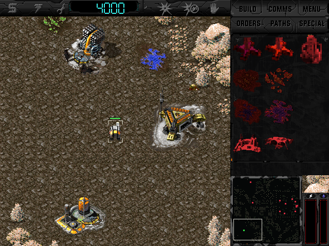
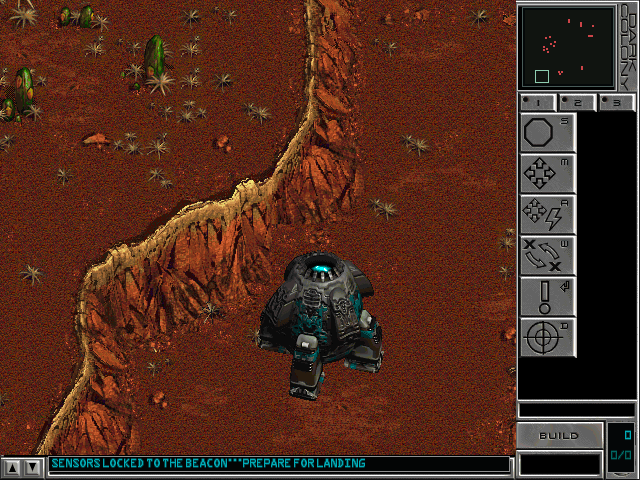
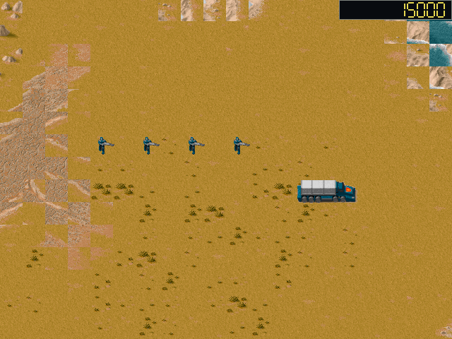
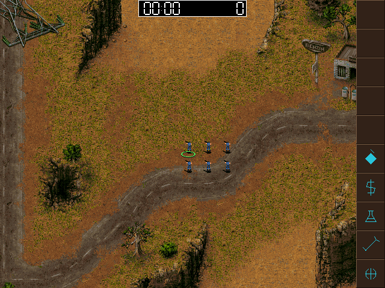

# open-rts

<table>
  <tr>
    <td></td>
    <td></td>
  </tr>
  <tr>
    <td></td>
    <td></td>
  </tr>
</table>

`open-rts` is a small C/SDL2 engine for sprite-based, 256-color strategy games,
currently wired to the original data files from Dark Reign: The Future of War,
Dark Colony, 7th Legion, and KKnD.

## Why open-rts exists

This is a preservation engine, not a general-purpose game-construction kit. Its
goal is to reproduce a broad family of DOS and early Windows RTS games closely
enough that they remain easy to run, study, play against the computer, and play
over a LAN. Old games are shared memories: the long-term aim is to let people
revisit them with friends and introduce them to their children without first
reconstructing a period-correct machine or fighting an abandoned network stack.

The architecture is deliberately influenced by Doom, Heretic, and Hexen. Those
engines solved a similar problem with unusually direct, durable code:

- `G_*` coordinates the game, `P_*` owns simulation, `R_*` owns rendering,
  `W_*` reads native resources, and `HU_*` owns the HUD.
- Units advance through compiled `state_t`-style tables with typed C action
  callbacks. State transitions, animation timing, and gameplay behavior are
  visible to the compiler and debugger.
- Simulation advances in discrete tics, separate from rendered frames. The
  intended network model is deterministic lock-step: exchange player commands
  for each tic, not continuously serialized world state.
- Each supported game keeps its native file formats and game-shaped procedures.
  Shared code is extracted only after the games demonstrate that it is truly
  shared.

The result is Doom's kind of architecture adapted to tile maps, large numbers
of independently commanded units, paletted sprites, terrain layers, resource
economies, production queues, computer opponents, and LAN play.

### Deliberately not a scripting platform

Many open-source RTS engines optimize for being universal modding platforms.
That commonly produces a large C++ core surrounded by Lua unit definitions,
JSON-like configuration, binding generators, asset-conversion pipelines, and
media libraries unrelated to the simulation. This can be useful for building
new games, but it is a poor fit for reproducing old ones: behavior is scattered
between languages, type errors move from compile time to runtime, call paths are
harder to follow, and a simple unit action may cross a scripting boundary for no
good reason.

[Stratagus](https://github.com/Wargus/stratagus), for example, is a capable and
long-running project, but its current build requires C++17, Lua 5.1 and
tolua++, SDL_image, SDL_mixer, PNG and zlib, with further optional media
libraries. Its games place substantial configuration, AI, triggers, and unit
behavior in Lua. That is exactly the architecture `open-rts` chooses not to
copy. A unit thinker written in C is fast to compile, statically checked, easy
to trace, and usually shorter than the machinery required to expose the same
logic safely to a scripting runtime.

[OpenRA](https://github.com/OpenRA/OpenRA) makes the opposite tradeoff in a
different direction: a large C# engine on the .NET runtime, forests of YAML
traits and mod manifests, Lua mission scripts, NuGet-managed native libraries,
and Python tooling in its mod SDK. Its flexibility is impressive, but requiring
a managed runtime, package ecosystem, trait-composition system, data-file
validation, and multiple languages to reproduce a 1990s strategy game is
architectural excess for this project's purpose. `open-rts` would rather
recompile a small, typed C program than start a virtual machine and interpret a
stack of loosely typed configuration before the first simulation tic.

There is no plugin registry, embedded scripting language, or generic object
schema here. Gameplay tables are C. Original assets are decoded directly.
Game-specific behavior stays beside the game that owns it. The standard is not
how configurable the engine looks in a feature list; it is whether the original
game behaves correctly and whether another programmer can understand why.

## Build

```sh
make
make run
make mission-1
make mission-2
make dark-reign
make dark-colony
make kknd
```

## Tests

Run the headless model tests without an SDL window:

```sh
make test
```

The default run expects the game data under the repository-local `data/`
directory:

```text
data/REIGN/dark
data/DCOLONY
data/KKND
```

You can override the data root, map, and unit sprite:

```sh
build/bin/open-rts --game dark-reign /path/to/dark scenario/MULTI/8JUNGLE/8JUNGLE.SCN ucfcnst0.spr
build/bin/open-rts --game dark-colony /path/to/DCOLONY SCENARIO/MPLAYER/D2PLAY01.MTG SPRITES/TROOPER1.SPR
build/bin/open-rts --game kknd /path/to/KKND LEVELS/640/SURV_01.LVL 'LEVELS/640/SPRITES.LVL|Infantry.mobd'
```

For a non-interactive loader/renderer check (uses SDL dummy driver — no display required):

```sh
env SDL_VIDEODRIVER=dummy build/bin/open-rts --check
env SDL_VIDEODRIVER=dummy build/bin/open-rts --check --game dark-colony
env SDL_VIDEODRIVER=dummy build/bin/open-rts --check --game kknd
env SDL_VIDEODRIVER=dummy build/bin/open-rts --screenshot /private/tmp/open-rts-smoke.bmp
env SDL_VIDEODRIVER=dummy build/bin/open-rts --screenshot /private/tmp/open-rts-dark-colony-ui.bmp --game dark-colony
```

If the map renders the same tile everywhere on a particular machine (Metal/GPU driver bug),
force the SDL software renderer:

```sh
build/bin/open-rts --software
build/bin/open-rts --software --game dark-colony
```

## Controls

- Left click: select a unit
- Left drag: box select
- Shift + left select: add to selection
- Right click: order selected units to move with grid A*
- Alt + left click: debug-spawn an enemy unit from the active plugin's actor
  table
- WASD/arrows: pan
- Middle drag: pan
- Mouse wheel: scroll camera
- `G`: toggle grid
- `Ctrl+A`: select all

## Shape

The repository is split into a shared engine and folder-per-game adapters:

```text
driver/             d_* startup and main loop; w_* shared file I/O
game/               g_* game coordination and headless model
play/               p_* mobj simulation, pathfinding, combat, and facing
render/             r_* map, sprite, effect, and viewport rendering
interface/          i_* SDL window and video backend
hud/                hu_* HUD and UI library
games/dark-reign/   Dark Reign formats, assets, actors, and UI layout
games/dark-colony/  Dark Colony formats, data-shaped runtime, and assets
games/7legion/      7th Legion BIM/COL formats and map loading
games/kknd/         KKnD LVL containers, MAPD terrain, and MOBD sprites
```

Game folders implement the `G_*`/`R_*` interface from `game/game.h`; the engine
calls them by name — no plugin registry. In particular, `GameUiDefinition` is a declarative list of native
image layers, viewport/minimap rectangles, command-grid geometry, and resource
display placement. The shared `GameUi` loader/renderer uses that description,
so another 256-color game does not need its own BMP compositor.

The code keeps old-game-specific file and coordinate details as adapters:

- Core renderer, picking, selection, movement, and A* all use one orthogonal
  tile grid. Each game is registered as a client-side plugin that supplies
  defaults, map loading, terrain visuals, and sprites.
- Actor type definitions are supplied by plugins as C arrays. The core now has
  first-pass reusable traits for `Selectable`, `Mobile`, `Renderable`, and
  `Attack`, so game plugins can share movement, selection, combat, and render
  plumbing instead of reimplementing those systems.
- `PALS` palette loader: 8-bit palette to ARGB.
- `TILE` tileset loader: Dark Reign `.TIL` terrain chunks, masks, shore tiles,
  generated transition frames, and shadow frames, decoded using OpenDR's frame
  layout instead of treating the file as a flat 576-byte tile array.
- `MAP_` + `.SCN` map loader: a scenario loads terrain from its same-basename
  sibling `.MAP` (not `TACTICS.MM`), plus map dimensions, scenario terrain
  selection, and `PutUnitAt(...)` starting units. The base terrain uses the
  first two bytes of each 6-byte terrain record in the same shape as OpenDR's
  importer: byte 1 provides terrain type plus variation group, byte 2 selects
  the variation bank, and bytes 3-6 carry elevation-related data. Water and
  cliff terrain are blocked for A*. Dark Reign transitions use OpenDR's edge
  match table and generated `.TIL` mask frames instead of cross-fading
  neighboring tiles.
- Dark Reign `.SCN` `AddThingAt(...)` and `AddBuildingAt(...)` entries are
  resolved through the shipped definition files' sprite names for common map
  objects: cliffs, rocks, trees, plants, rubble, water doodads, water wells,
  and Taelon mines.
- `BOTG`/FTG archive loader: extracts contained files.
- `RSPR`/`SSPR` sprite loader: decodes paletted RLE sprite frames.
- Per-map coordinate metadata keeps Dark Reign top-down and Dark Colony
  bottom-up world coordinates explicit. Movement stores the engine-facing once;
  the shared renderer consumes it instead of reinterpreting axes per frame.
- Dark Colony `.SPR` loader: embedded palette, frame descriptors, and raw
  indexed pixels. Unit animation is driven by generated Doom-style
  `sprnames[]`, `states[]`, and `mobjinfo[]` tables.
- Dark Colony `GAMESTAT.TXT`/`WEAPSTAT.TXT` actor and weapon values are mirrored
  into the plugin C actor table for first-pass health, attack range, damage,
  cooldown, and attack animation timing.
- Dark Colony `.MAP` loader: width/height plus 6-byte map records. It uses the
  sibling `.O16` overview for first-pass terrain colors while the true terrain
  tile/remap resources are reverse engineered.
- KKnD `DATA`/`.LVL` container loader: resolves typed file lists and their
  archive-global offsets. The first Survivor mission's two `MAPD` layers are
  decoded with their embedded palette and 32×32 tiles; `MOBD` sprite images
  are decoded from `SPRITES.LVL`, including Gen1 scanline compression and
  16-facing stand, attack, and walk sequences.

That gives a place to add sibling adapters later for Dark Colony, Warcraft II,
or other 8-bit paletted games without changing the simulation loop.

## Research Notes

- Architecture is intentionally command/simulation/render separated, following
  the Age of Empires networking paper's core idea that old RTS engines should
  keep a shared simulation driven by user commands rather than syncing every
  unit's position every frame.
- Grid navigation follows Red Blob Games' framing of grids as graph nodes for
  A*/Dijkstra-style search, with room later for waypoints, hierarchical grids,
  JPS, or flow fields when unit counts grow.
- Dark Reign map loading is based on the shipped `MAP_`, `TACTICS.MM`, and
  `.SCN` files plus OpenDR's public importer. The remaining packed terrain
  fields still need more reverse engineering for exact movement masks,
  elevation, and the original transition compositor.

Sources:

- Project reverse-engineering links and local data notes:
  [REFERENCES.md](REFERENCES.md)
- Paul Bettner and Mark Terrano, “1500 Archers on a 28.8: Network Programming
  in Age of Empires and Beyond”:
  https://zoo.cs.yale.edu/classes/cs538/readings/papers/terrano_1500arch.pdf
- Red Blob Games, “Grid pathfinding optimizations”:
  https://www.redblobgames.com/pathfinding/grids/algorithms.html
- Dark Reign Construction Kit notes:
  https://thevideogamedatabase.fandom.com/wiki/Dark_Reign:_The_Future_of_War
- drExplorer reference for Dark Reign FTG archives:
  https://github.com/btigi/drExplorer
- OpenDR importer and terrain renderer:
  https://github.com/drogoganor/OpenDR
