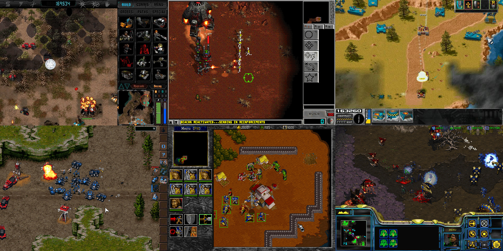

# open-rts



`open-rts` is a shared C engine for recreating sprite-based real-time strategy
games of the 1990s. One simulation, one indexed renderer, one menu toolkit, and
one lockstep network loop serve every title. Each game is a directory that
decodes that title's own retail files and fills in the behavior those files
do not share.

The games are Dark Reign: The Future of War, Dark Colony, 7th Legion,
KKnD (Krush, Kill 'N' Destroy), Warcraft II, and StarCraft. You supply a legitimate
copy of the retail data under `data/`. The engine does not ship those assets,
and it does not convert them to a private format.

This is a preservation project. The aim is to keep these games runnable,
readable, and playable against the computer or with friends on a LAN, without
rebuilding a period-correct machine or an abandoned network stack.

## Why it is built this way

The layout follows Doom, Heretic, and Hexen. Those engines stayed small
because the interesting data was compiled in, and the loop that advanced it
was ordinary C:

- `G_*` coordinates a game, `P_*` owns the simulation, `R_*` draws, `W_*`
  reads files, and `HU_*` owns the HUD.
- A unit is an `mobj_t` on one thinker list. Its animation and behavior are a
  row in a `state_t` table. When a state is entered, its C action runs.
- Simulation advances in fixed tics. Rendered frames are separate. Network
  play exchanges each player's commands for a tic and waits until every peer
  has that tic. Positions are not synchronized.

Shared code is added when two games already do the same thing. A loader, a
mission script, or a sidebar that is shaped like one retail game stays in
that game's directory.

Gameplay tables are C. A unit's numbers, its animation, and the function
that runs when that animation starts are all in one translation unit. The
compiler checks the field names. A wrong type is a build error. There is no
plugin registry and no embedded language. Original assets are decoded
directly into the indexed images the renderer already draws.

C99 designated initializers are the configuration language. You name the
field, you nest the struct, and every field you leave out is zero. The
Warcraft II footman is a row in `games/warcraft-2/info.c`. `.grp` is an index
into retail `MAINDAT.WAR`, the same GRP the 1995 game drew. The row in the
file also stores reaction range, points, and the rest of the native block;
these are the fields that line up with the Lua further down:

```c
[MT_FOOTMAN] = { /* PUD 0: unit-footman */
    .doomednum = 1, .spawnhealth = 60,
    .name = "footman", .label = "Footman",
    .w2 = {
        .projectile = W2_FX_NONE,
        .flags = W2_MOBILE | W2_COMBAT,
        .footprint = {1, 1}, .box = {31, 31},
        .grp = {45, 0, 0, 0},
        .speed = 10, .armor = 2,
        .basic_damage = 6, .piercing_damage = 3,
        .sight = 4, .attack_range = 1,
        .costs = {.time = 60, .resources = {600, 0, 0}},
        .food = {0, 1},
        .attributes = W2_ORGANIC | W2_RECT_SELECT | W2_CAN_ATTACK,
    },
},
```

The moving state in `games/starcraft/info.c` is the same kind of row.
`.action` is a function, so the debugger lands in `A_Chase` when the state
is entered:

```c
states[walk] = (state_t){
    .sprite = i, .tics = 1, .action = A_Chase,
    .nextstate = walk, .group = 2,
};
```

Policy that would otherwise be a pile of globals is one struct. This is the
Warcraft II `gameinfo_t` in `games/warcraft-2/info.c`:

```c
game_info = (gameinfo_t){
    .sprnames = (const char *const *)sprnames,
    .sprite_count = W2_SPRITE_COUNT,
    .states = states,
    .state_count = W2_STATE_COUNT,
    .mobjinfo = mobjinfo,
    .mobj_type_count = W2_MOBJ_COUNT,
    .null_state = 0,
    .state_coord_mode = RTS_STATE_COORDS_GROUND_OFFSET,
    .selection_marker = { .style = SELECTION_STYLE_DEFAULT },
    .draw_underlays = w2_draw_selection,
    .draw_overlays = w2_draw_buffs,
    .right_click_orders = true,
    .radial_sight = true,
    .select_any = true,
    .f10_menu = true,
    .instant_turn = true,
    .sound = &w2_soundinfo,
    .draw_fog = w2_draw_fog,
};
```

[Stratagus](https://github.com/Wargus/stratagus) throws that away and then
rebuilds it badly. Wargus describes the same footman in Lua, and the picture
is a PNG that an extractor wrote out of the GRP:

```lua
DefineUnitType("unit-footman", { Name = _("Footman"),
  Image = {"file", "human/units/footman.png", "size", {72, 72}},
  Animations = "animations-footman", Icon = "icon-footman",
  Costs = {"time", 60, "gold", 600},
  Speed = 10,
  HitPoints = 60,
  -- ...
  Sounds = {
    "selected", "footman-selected",
    "acknowledge", "footman-acknowledge",
    "ready", "footman-ready",
    "help", "basic human voices help 1",
    "dead", "basic human voices dead"} } )
```

[Stargus](https://github.com/Wargus/stargus) is the same pipeline with the
conversion left in the open. `ImagesConverter` reads the retail GRP, and
`Grp::save` stitches it into a PNG (`SaveStitchedPNG`). The converter then
emits a Lua file whose only job is to remember the path of the PNG it just
wrote. Stratagus boots, interprets the Lua, and `CGraphic::Load` hands the
file to SDL_image:

```cpp
mSurface = IMG_Load_RW(CFile::to_SDL_RWops(std::move(fp)), 1);
```

So a 256-color sprite is rewritten as a PNG, named from a script, parsed by
Lua, and decoded back into pixels by libpng.
Stratagus also ships `png2stratagus`, whose own comment tells you to paint
an RGBA image in Gimp, quantize it to 227 colors, and run the tool so the
engine will accept the palette. The palette was already in the GRP.

`games/starcraft/w_assets.c` reads that GRP. Frame offsets, the RLE of each
row, and the 17-facing mirror stay indexed. Nothing is resampled, and
nothing is handed to another language on the way to the framebuffer.

[OpenRA](https://github.com/OpenRA/OpenRA) does the same kind of damage with
YAML. A rifleman is a pile of trait names, inherited from `^Soldier` and
merged at startup:

```yaml
E1:
	Inherits: ^Soldier
	Inherits@EXPERIENCE: ^GainsExperience
	Inherits@AUTOTARGET: ^AutoTargetGroundAssaultMove
	Valued:
		Cost: 100
	Health:
		HP: 5000
	Mobile:
		Speed: 54
	Armament:
		Weapon: M16
	WithInfantryBody:
		IdleSequences: idle1,idle2,idle3,idle4
```

Supporting that meant writing a language. `OpenRA.Game/MiniYaml.cs` is a
parser, a string pool, an inheritance walker, and a deletion syntax: a key
that starts with `-` removes a trait a parent already added. The engineer
in that same file is `E6`, and it deletes an inherited attack with
`-AttackFrontal`. `FieldLoader` then reflects the surviving
strings onto C# objects. A misspelled field is a runtime exception. The
equivalent mistake in the footman row above is a compiler error, and the
field you did not mention is zero rather than "whatever `^Soldier` last
merged".

Lua and YAML are fine for a project whose point is user mods. They are a
strange foundation for a program whose job is to do what a 1990s executable
already did in C.

## What the tree contains

```text
driver/             startup, the main loop, file and image I/O, lockstep net
game/               level lifecycle, commands, the shared save format
play/               thinkers, movement, pathfinding, sight, combat, production
render/             the 8-bit map, sprites, fog, and viewport
hud/                menu and HUD widgets, shared multiplayer screens
interface/          the SDL window and the indexed-framebuffer present
sound/              channels and the listener, over a small mixer
games/<id>/         one retail game: loaders, tables, actions, screens
include/engine.h    the engine and the names a game must define
include/<id>.h      what tests and tools call on that game
tests/              headless suites, linked against one game at a time
tools/              C extractors and table generators; not part of the runtime
docs/               per-game findings, formats, and fidelity limits
data/               retail files you provide (gitignored)
```

`make` builds six binaries. The engine sources are compiled into each one
with that game's directory on the include path. `build/bin/dark-colony` is
the Dark Colony program; it cannot load Warcraft II. Adding a file under
`games/<id>/` or under an engine directory picks it up automatically.

Reference checkouts (Doom, OpenDR, OpenKrush, Wargus, Stargus, and others)
live in `reference/` and are gitignored. Provenance is in
[REFERENCES.md](REFERENCES.md).

## What the engine does

The engine owns the parts that are the same once a map is a grid of cells
and a unit is an object with a state:

- An 8-bit framebuffer. Terrain, sprites, fog, and chrome are indexed pixels.
  Palette lookups happen at draw time, so water can cycle colors without a
  second copy of the tiles. SDL uploads that buffer as one texture.
- The thinker loop. Objects are allocated, linked, and removed the way Doom
  removes them. `P_Ticker` advances movement, combat, production, and mission
  scripts on the tic.
- Orders. Selection, movement, attack, harvest, and production enter as
  commands. The same commands drive the window and the headless tests.
- Pathfinding and sight on the game's cell grid, and a fog-of-war calculation
  the game paints in its own tiles.
- Menu and HUD behavior. A screen is a `menu_t` of `menuitem_t` rows. The
  engine hit-tests, keeps focus, edits text, scrolls lists, and draws. A
  game describes the screen; it does not run its own responder loop.
- Lockstep networking in `driver/d_net.c`, and the shared create, browse,
  join, and lobby flow in `hud/m_net.c` for games that use it.
- A saved-game format in `game/g_save.c` for the level and its objects.
- A computer-player scheduler (economy, defense, attack waves, a build
  ladder). The game answers which products exist and how to buy them.

Rendering reads simulation state. It does not decide who won.

## What a game supplies

A game is `games/<id>/`, linked as its own binary. `-I./games/<id>` makes
that directory's `info.h` and `mobj_data.h` the headers the engine includes.
The engine calls the functions below by name. Nothing is registered at
startup.

**Identity.** `g_game_id`, `g_game_name`, the default data root, map, and
sprite, the map cell size (`g_cell_w`, `g_cell_h`), and the `actor_types`
table.

**Two object tables.** `info.h` defines `mobjinfo_t`, sprite names, state
numbers, and type numbers in the Doom shape. `info.c` fills `states[]`,
`mobjinfo[]`, and a `gameinfo_t`. `mobjinfo` is the type's state entry
points (spawn, walk, attack, death). `states[]` is the animation: sprite,
frame run, duration in tics, the action called on entry, and the next state.
`gameinfo_t` tells the renderer how selection is drawn, whether the right
button issues orders, how fog is painted, and whether the game has sound.

**Stats, as C.** `actor_types` is an array of `mobjtype_t`. A row is speed,
hit points, sight, weapon, harvest, footprint, and trait flags such as
`MF_MOBILE`, `MF_ATTACK`, and `MF_HARVESTER`. The numbers are taken from the
retail data and written as literals. The running game does not re-read a
binary stat table to spawn a unit.

**Fields that belong to one game.** `mobj_data.h` defines
`MOBJ_GAME_FIELDS`, which is pasted into `mobj_t`. An empty macro is a
complete implementation. Dark Colony uses it for dropship payloads; Warcraft
II uses it for lumber, construction, and spells. Those fields have one owner,
the object, and they live until the thinker is freed.

**Loaders.** The game turns retail bytes into the engine's containers.

- `G_DoLoadLevel` fills a `level_t`: dimensions, tile ids, the blocked mask,
  resources, and any mission pointer the map owns.
- `P_LoadThings` spawns the map's starting objects.
- `W_LoadAssets` and `R_InitSprites` decode tiles and sprites into the shared
  indexed images.

Native coordinates stay native until the screen edge. Dark Colony's world
axis runs upward; the other five games run downward. The Makefile sets that
with the binary. Loaders do not flip the map to match another game.

**Screens.** `G_InitMenus`, `G_ControlPanel`, and `G_ShutdownMenus` build the
front end. `G_InitHUD` and `G_ShutdownHUD` build the in-game panel. Both are
`menu_t` tables. Pictures the table cannot express use an `ownerdraw`
callback. `G_WorldViewport` is the rectangle of the window that shows the map.

**Production and the mission.** A product table records cost, producer, time,
and prerequisites. `G_UpdateProduction` advances queues during play.
`G_MissionTicker` advances the script attached to the level, and
`G_MissionState` reports an active game, a win, or a loss. `G_AiInterface`
connects the shared computer player, or the game keeps that logic itself.

**Actions.** Anything an animation does is `void Action(mobj_t *actor)`,
stored on the state. Spawning does not call the action; entering the state
does.

A game that must save more than the level and its objects defines
`G_SaveExtraSize`, `G_SaveExtra`, and `G_LoadExtra`. The engine copies are
weak and store nothing. Dark Colony uses its own saver, because a Dark Colony
save also stores the mission script. A game with retail audio fills a
`soundinfo_t` and points `gameinfo_t.sound` at it.

## The six games

| Game | Binary | Retail data | What that directory decodes |
| --- | --- | --- | --- |
| Dark Reign | `build/bin/dark-reign` | `data/REIGN/dark` | `.SCN` / `.MAP`, `.TIL` tiles, `.SPR` sprites, `SHELL.RLD` menus |
| Dark Colony | `build/bin/dark-colony` | `data/DCOLONY` | `.MAP`, `.SPR`, `.FIN` animation, `SOUND/` |
| 7th Legion | `build/bin/7legion` | `data/7LEGION` | `GFX/*.BIM` sprites and tiles, mission maps |
| KKnD | `build/bin/kknd` | `data/KKND` | `.LVL` containers, `MAPD` terrain, `MOBD` sprites, `UNITS.CFG` |
| Warcraft II | `build/bin/warcraft-2` | `data/WAR2` | `.PUD` maps, `DATA/MAINDAT.WAR` |
| StarCraft | `build/bin/starcraft` | `data/STARCRAFT` | unpacked `CHK`, `GRP`, `PCX`, `FNT`, `DAT`, `TBL`, terrain |

### Dark Reign

The shell is the retail one: `SHELL.RLD` art and the `SHELLCFG.H` layout.
**Single Player → Start New Game** shows the mission map; pick a faction and
**Launch** from the briefing. **Instant Action** is the skirmish setup.
**Multi Player → Local Area Network** lists games; **Create Game** and
**Manual IP** reach the lobby, where each player sets side and team and
presses **READY**. In a level, Escape or the HUD **MENU** button opens the
options screen.

The campaign starts from the Freedom Guard mission data, with construction
crews, transporters, and the authored product list. Ground and hover
harvesters, the native HUD chrome, and route waypoints are in. Passenger
transports, phasing, and the full mission state machine are tracked in
[docs/DR_DEVELOPMENT_STATUS.md](docs/DR_DEVELOPMENT_STATUS.md). Findings:
[docs/DR_EXE_FINDINGS.md](docs/DR_EXE_FINDINGS.md).

```sh
make dark-reign
build/bin/dark-reign data/REIGN/dark scenario/FIXED/M01F/M01F.SCN ucfcnst0.spr
```

### Dark Colony

Dark Colony is the game the engine is being matched against first. When a
generic mechanism and `DC.EXE` disagree, `DC.EXE` wins.

The native main menu is implemented. **New Campaign** asks for Human or Gray
and a leader name, then **Start Campaign → Next → To Battle**. Training uses
the same setup. Escape opens the menu and pauses a single-player game.
**Load Game** reads engine saves from the in-game Save dialog. Those saves
store thinkers, production, resources, fog, alliances, the computer player,
mission progress, and the camera. They are a versioned engine format, tied
to the map and the state tables, and they are not `DC.EXE` save files. Saves
and `settings.cfg` live in SDL's `open-rts/dark-colony` preference directory.
`OPEN_RTS_USER_DIR` overrides that directory.

The third sidebar tab is Quit (Q), Save (F11), Options (O), Allies, Pause
(T), and Objectives (J). Allies lists players in their original slots. Peace
and shared vision are reciprocal. The transfer button sends 1000 credits when
the sender has more than that. Sounds are the retail set: acknowledgements,
weapons, deaths, dropships, ambience, and button clicks, faded by distance
from the view. `--nosound` disables them.

```sh
make dark-colony
build/bin/dark-colony -map=SCENARIO/HUMAN/HUMAN01.MAP
```

Findings: [docs/DC_EXE_FINDINGS.md](docs/DC_EXE_FINDINGS.md).

### 7th Legion

The directory loads `BIM` sprites and tiles and the mission map, and it
spawns the units whose stats have been taken from the retail data. Production
uses the shared queue on a plain sidebar. The front end is the engine's
simple menu, not a decoded retail shell. Unit coverage and the mission
encoding are in [docs/7LEGION_EXE_FINDINGS.md](docs/7LEGION_EXE_FINDINGS.md).

```sh
make 7legion
```

### KKnD

A `.LVL` supplies the `MAPD` terrain layers, the embedded palette, and the
`CPLC` placements, including the opening camera. `MOBD` sprites come from
`SPRITES.LVL`, with the native stand, attack, and walk sequences. Stats for
the actor table come from `UNITS.CFG`. Product costs, producers, and research
are C rows imported once from the OpenKrush rules and drawn on the engine
HUD. The retail sidebar and font are not reproduced.
[docs/KKND_EXE_FINDINGS.md](docs/KKND_EXE_FINDINGS.md).

```sh
make kknd
```

### Warcraft II

The binary opens `data/WAR2` and defaults to `ALAMO.PUD`. Menus come from the
retail dialog records. The left panel, fog tiles, gathering, construction,
combat, repair, transport, and spells live in `games/warcraft-2/`. Orders are
on the right button. Sound is the retail set. Multiplayer uses the shared
session, dressed with the Warcraft panel. Extra save data (dice and campaign
progress) goes through `G_SaveExtra`.

```sh
make warcraft-2
build/bin/warcraft-2 --map SOME.PUD
```

Formats and limits: [docs/WAR2_DATA.md](docs/WAR2_DATA.md),
[docs/WAR2_EXE_FINDINGS.md](docs/WAR2_EXE_FINDINGS.md).

### StarCraft

The original animated main menu is the front end. **Single Player** reads a
race's briefing and starts that campaign. **Multiplayer** opens the original
connection and chat screens over a TCP melee; each player picks Terran, Zerg,
or Protoss. The right button moves, attacks, and gathers. The command card
builds and trains. Campaign missions run the shared computer player. Spell,
creep, burrow, and the retail script opcodes are open work, recorded in
[docs/SC_EXE_FINDINGS.md](docs/SC_EXE_FINDINGS.md).

Runtime files are unpacked retail assets. The game does not open an MPQ.
`make starcraft-unpack` extracts a disc image from
`data/STARCRAFT/StarCraft.iso` into `data/STARCRAFT/`. The importer needs
CMake, StormLib, zlib, bzip2, and bsdtar; pinned sources are listed in
[REFERENCES.md](REFERENCES.md#starcraft--stargus-2026-10-08). Byte layouts:
[docs/SC_FORMATS.md](docs/SC_FORMATS.md).

```sh
make starcraft
build/bin/starcraft --map install/campaign/terran/terran01/staredit/scenario.chk
make starcraft-catalog    # browse the 228 retail unit slots with [ and ]
make test-starcraft
```

## Build

SDL2 must be visible to `pkg-config`. A C11 compiler is enough for every
binary except the StarCraft unpacker.

```sh
make
make dark-reign
make dark-colony
make 7legion
make kknd
make warcraft-2
make starcraft
```

`make run` and `make mission-1` / `make mission-2` start Dark Reign.

Passing a map on the command line skips the front end and loads that map.
`--map <path>`, `--map=<path>`, and a positional map argument all do this.
`--check` and `--screenshot` load without a window and force the software
present path. A `--screenshot` with no map captures the main menu.

```sh
env SDL_VIDEODRIVER=dummy build/bin/dark-colony --check
env SDL_VIDEODRIVER=dummy build/bin/warcraft-2 --screenshot /tmp/war2.bmp
```

## Window

Every game opens at 1280×960. The HUD and menus are drawn at 2×. Terrain and
unit sprites stay at their retail pixel size, so the window shows twice the
retail view in each direction. Resizing changes the world framebuffer. The
UI scales by a whole number. `--window 640x480` is the retail UI size.

`RTS_NATIVE_WORLD` is on by default. `make clean && make NATIVE_WORLD=0`
restores a fixed 640×480 framebuffer scaled up to the window.

`--software` selects SDL's software backend for the texture upload. The map
is indexed pixels either way. Use it when a GPU driver paints every cell with
the same tile.

## Controls

Dark Reign, Dark Colony, 7th Legion, and KKnD:

- Left click selects a friendly unit, or orders the selection to move, attack,
  or harvest
- Left drag box-selects; Shift-click adds to the selection
- Right click clears the selection
- WASD, arrows, middle drag, and the wheel pan the camera
- `G` toggles the grid; `Ctrl+A` selects everything you own

Warcraft II and StarCraft keep selection on the left button and put move,
attack, and gather on the right button (`gameinfo_t.right_click_orders`).

Alt-click debug-spawns an enemy from `g_debug_enemy_type`.

## Network

Host and join are engine commands. Both processes need the same build and the
same retail data. The host chooses the map and the slots.

```sh
build/bin/dark-colony --host --map SCENARIO/MPLAYER/D2PLAY01.MAP
build/bin/dark-colony --join 192.168.1.10
```

`127.0.0.1` runs two windows on one machine. `J2PLAY01.MAP` is human versus
human. `--players 4` with `SCENARIO/MPLAYER/J4PLAY01.MAP` is four players.
Dark Colony, Dark Reign, Warcraft II, and StarCraft each present that session
with their own screens. Setup, the protocol, and the tests are in
[docs/NETWORK.md](docs/NETWORK.md).

## Tests

```sh
make test
make test-starcraft
```

`make test` builds and runs the headless model, loader, and per-game suites.
It expects retail data under `data/`. Suites do not open a visible window;
set `SDL_VIDEODRIVER=dummy` when you run a single test binary yourself.

## Further reading

- [ARCHITECTURE.md](ARCHITECTURE.md) — objects, tics, production, menus
- [REVERSE_ENGINEERING.md](REVERSE_ENGINEERING.md) — how a retail executable is traced
- [REFERENCES.md](REFERENCES.md) — external sources and local data notes
- Paul Bettner and Mark Terrano, “1500 Archers on a 28.8: Network Programming
  in Age of Empires and Beyond”:
  https://zoo.cs.yale.edu/classes/cs538/readings/papers/terrano_1500arch.pdf
