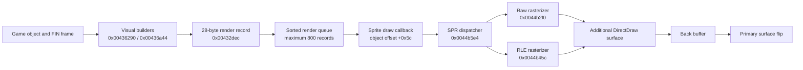

# DC.EXE Rendering and Animation Findings

This document records the Dark Colony executable behavior established while
investigating sprite placement and unit animation in open-rts. It is a focused
technical report, not a complete decompilation. Addresses refer to the exact
executable fingerprint below.

## Executable fingerprint

| Property | Value |
| --- | --- |
| File | `data/DCOLONY/DC.EXE` |
| SHA-256 | `008052f5bc7fadfbf3809187256b000dd0115aaef1ab4fd0a9c26dfe93661f5a` |
| Size | 566,272 bytes |
| Format | PE32, little-endian, i386, Windows GUI |
| Image base | `0x00400000` |
| Compile timestamp | August 11, 1997 20:53:20 |

The file has the normal DOS-compatible PE header, but it is a 32-bit Windows
executable, not a DOS game binary. It is not stripped, although the available
symbols are not sufficient to recover original function names. Embedded assert
strings expose source-unit names including `animate.c`, `juicel.c`, `mobiles.c`,
`objects.c`, `vobj.c`, `engmain.c`, `sprite.c`, `sprites.c`, `collide.c`,
`path.c`, `ai.c`, and `trigger.c`.

The radare2 installation may print a missing `dplayx.sdb` warning while loading
the executable. This only means its DirectPlay type database is unavailable; it
does not prevent code or data analysis.

## Rendering architecture

DC.EXE imports `DirectDrawCreate`, but calls the remaining DirectDraw API through
COM vtables. DirectDraw manages display mode, surfaces, palette, presentation,
and some surface-to-surface composition. Normal game sprites are decoded and
rasterized by the CPU into locked surface memory.



### DirectDraw objects

Graphics setup begins around `0x0042bbf0`. Surface setup at `0x0042bdc4`
creates and stores:

| Address | Object |
| --- | --- |
| `0x004745ec` | `IDirectDraw` |
| `0x004745f0` | Primary surface |
| `0x004745f4` | Attached back buffer |
| `0x004745f8` | Additional rendering surface |
| `0x004745fc` | Palette |
| `0x004c1120` | Start of 32 auxiliary-surface pointers |

Confirmed DirectDraw v1 vtable slots are:

| Interface offset | Operation |
| --- | --- |
| `IDirectDraw +0x18` | `CreateSurface` |
| `IDirectDraw +0x50` | `SetCooperativeLevel` |
| `IDirectDraw +0x54` | `SetDisplayMode(640, 480, 8)` |
| `IDirectDrawSurface +0x1c` | `Blt` |
| `IDirectDrawSurface +0x2c` | `Flip` |
| `IDirectDrawSurface +0x30` | `GetAttachedSurface` |
| `IDirectDrawSurface +0x44` | `GetDC` |
| `IDirectDrawSurface +0x64` | `Lock` |
| `IDirectDrawSurface +0x68` | `ReleaseDC` |
| `IDirectDrawSurface +0x74` | `SetColorKey` |
| `IDirectDrawSurface +0x7c` | `SetPalette` |
| `IDirectDrawSurface +0x80` | `Unlock` |

Presentation routine `0x0042b54c` blits the additional surface to the back
buffer, optionally composites one of the auxiliary surfaces, and flips the
primary surface. This is distinct from per-sprite drawing.

### Render queue

Gameplay visual builders at `0x00436290` and `0x00436a44` submit 28-byte
records through `0x00432dec`. The queue has a native limit of 800 records. This
matches the broader executable convention of fixed-capacity object storage;
open-rts preserves `DC_MAX_OBJECTS == 800` and the observed object stride
`DC_OBJECT_SIZE == 0xdc` in its Dark Colony model.

The SPR draw routine is reached through a callback rather than a normal direct
call. Constructor `0x004297e4` installs dispatcher `0x0044b5e4` at object offset
`+0x5c`. Consequently, static call-reference searches do not reveal the whole
sprite call chain.

### Terrain overlays and object origins

Dark Colony foreground terrain uses a different vertical origin from the
ground tile beneath it. The foreground stamp begins half a 32-pixel cell below
the keyed ground-tile origin. Applying the ground-tile origin to both layers
places foreground features 16 pixels too high. This affects city pads such as
the base pentagon and terrain-baked resource craters, but not the city objects
or sprite effects drawn over them.

The object renderer at `0x00436290` submits each FIN part as the object's native
fixed-point position plus the FIN part offset. The SPR dispatcher then adds the
cell's `disX` and `disY`; it does not derive a new object origin from the visible
bitmap bounds. The mine-cell assertion at `0x00412c5a` likewise indexes the map
directly with `vent->z_pos >> 8` and `vent->x_pos >> 8`.

The active crater and glow assets corroborate this composition. `VENT.SPR`
frame 0 has displacement `(2,22)`, while `VENT2.SPR` frame 0 has displacement
`(31,37)`. Their relative offset is therefore `(29,15)`. Once the crater's
foreground stamp is drawn at its half-cell origin, the glow and the Exploiter
attachment no longer appear below the crater. Moving TOWR, city slots, the
plume, or the Exploiter target would compensate in the wrong coordinate path.

## Native SPR behavior

The SPR loader at `0x0044b048` reads:

1. Header flags, cell count, and payload size.
2. A palette of 256 RGB triplets.
3. One 8-byte descriptor for every cell.
4. Raw or chunked pixel payloads.

An on-disk cell descriptor is:

```c
struct DcSprCellDisk {
    uint16_t width;
    uint16_t height;
    uint16_t dis_x;
    uint16_t dis_y;
};
```

The loader expands this to a 24-byte runtime descriptor containing the four
words, data pointers, a used marker, and decoded or chunk byte counts. Header
flags masked by `0x180` select the chunked/RLE path.

### Cell displacement

Dispatcher `0x0044b5e4` validates the frame index, obtains the runtime cell,
adds both displacement fields to the requested point, clips, and selects the
raw or RLE rasterizer:

```text
draw_x = input_x + cell.disX
draw_y = input_y + cell.disY
```

The relevant instructions load `[cell+4]` for `disX` and `[cell+6]` for
`disY`, then add each to the corresponding draw coordinate before clipping.
Therefore `disY` is active placement metadata. Treating it as padding or
forcing it to zero diverges from DC.EXE and can vertically misalign buildings,
units, overlays, and multi-part sprites.

## Native FIN behavior

The FIN loader at `0x004230ac` loads files from `animate/%s`, resolves their SPR
dependencies under `SPRITES/`, reads animation labels and frame metadata, and
expands 22-byte draw commands. Internal error strings call FIN files "juice
files" and label ranges "angles".

Each draw command contains:

```text
char sprite_name[8]
i16  sprite_cell
i16  x
i16  y
i16  remap
i16  intensity
i16  layer
i16  flags
```

The loader converts authored FIN coordinates to fixed render units:

```text
runtime_x = FIN.x * 8
runtime_y = FIN.y * -8
```

The render path later converts these fixed values back while preserving the
authored integer offsets. A displayed part is therefore not defined by its SPR
cell alone. Its identity is the combination of SPR cell, FIN x/y, flip flags,
remap, intensity, and layer.

The exact semantic names of layer values `0`, `1`, `3`, and `5`, and of FIN flag
value `1`, have not yet been proved from every consumer. They should remain
native numeric fields until those paths are traced.

### Frame timing

FIN frame word `+2` is a raw delay. At `0x00423544`, DC.EXE replaces zero with
`15`. Instructions at `0x00423563..0x0042358f` then calculate:

```text
runtime_ticks = ((raw_ticks + 3) * 19) / 100
```

This uses integer arithmetic. For example, the eight frames of `REAPMOVE0`
store:

```text
20, 13, 13, 20, 6, 13, 13, 6
```

They become:

```text
4, 3, 3, 4, 1, 3, 3, 1
```

The varying delays are part of the animation. Replacing them with a uniform
duration makes the cycle look incomplete even when every timeline step is
present. `EXPLMOVE*` uses zero raw delays; zero normalization gives those frames
three runtime ticks.

## Directional animation

Function `0x00423a50` constructs directional animation sets:

1. It concatenates the unit stem and state keyword using `%s%s` at
   `0x0046fccc`.
2. It probes 16 numbered labels using `%s%d` at `0x0046fcd4`.
3. The probed suffix is `(12 - index) & 15`.
4. It expands the 16 results into a 32-entry heading table.
5. Missing labels use a nearby available angle selected through the fallback
   table at `0x00474500`.

This establishes that odd-numbered angle labels are real runtime inputs, not
discarded editor data. State keywords visible near the unit-definition loader
include `MOVE`, `STAND`, `DIEA`, `DIEB`, `DIEC`, `DEPLOY`, `FUNK`,
`BUILDSTAND`, `BUILD`, `SCRCH`, `BURN`, and `BLOOD%c`.

### Reaper

`REAP.FIN` has eight principal movement ranges with eight timeline frames each:

| Label | Inclusive FIN frames |
| --- | --- |
| `REAPMOVE0` | `16..23` |
| `REAPMOVE14` | `24..31` |
| `REAPMOVE12` | `32..39` |
| `REAPMOVE10` | `40..47` |
| `REAPMOVE8` | `48..55` |
| `REAPMOVE2` | `56..63` |
| `REAPMOVE4` | `64..71` |
| `REAPMOVE6` | `72..79` |

Odd `REAPMOVE1/3/.../15` labels contain single intermediate-angle poses. Fire
ranges contain five frames. Death ranges vary and contain 10, 11, 14, 15, 26,
or 27 frames depending on direction.

The even-direction walk cycles deliberately reuse cells with different flags
and offsets. `REAPMOVE0` contains:

```text
9, 17, 25, 33, 9 flipped, 17 flipped, 25 flipped, 33 flipped
```

The flipped half has x offsets around `-24`, while the unflipped half has offsets
around `-157`. Counting unique SPR cell numbers yields only four, but DC.EXE
displays an eight-step cycle because flip state, FIN offset, and timing are all
part of each step. Mirroring an already-normalized canvas around its center is
not equivalent to this behavior.

### Exploiter

`EXPL.FIN` also supplies all 16 directional poses:

- Even `EXPLSTAND*` labels provide the principal standing facings.
- Odd `EXPLSHUF1/3/.../15` labels provide intermediate poses.
- Even `EXPLMOVE0/2/.../14` labels provide two-frame movement cycles.
- Later odd `EXPLMOVE1/3/.../15` labels provide one-frame poses.

Open-rts currently emits only eight even direction codes for Exploiter stand,
run, and deploy states. Its simulation can stop on odd 16-direction headings,
but `state_facing_slot()` then chooses nearby even art. The original odd
`EXPLSHUF*` and odd `EXPLMOVE*` poses are consequently not displayed.

It remains unresolved whether DC.EXE selects `SHUF` specifically during a
turn-in-place transition and the later odd `MOVE` set during translation, or
uses another gameplay distinction. That question belongs to callers of the
animation-set constructor, not to the generic renderer.

## Consequences for open-rts

The executable evidence gives several implementation rules:

1. Apply both SPR `disX` and `disY` before clipping.
2. Preserve FIN x/y independently for every body and overlay part.
3. Treat a frame as cell plus flags, offsets, remap, intensity, and layer.
4. Preserve converted per-frame FIN timing rather than assigning one duration
   to an entire sequence.
5. Preserve 16-angle labels where the assets provide them.
6. Implement missing-angle selection as animation-table behavior, not as a
   sprite-name-specific rendering exception.
7. Keep the fixed render queue and native object-layout limits visible while
   reconstructing behavior.
8. Keep foreground terrain's half-cell vertical origin separate from both
   ground-tile placement and sprite-object placement.

These findings rule out moving terrain or city slots to compensate for sprite
misalignment. The original placement path composes FIN offsets and both SPR
displacements; visual corrections should reproduce that composition.

## Known unknowns

- The complete semantics and ordering rules for every FIN layer value.
- The exact meaning of all FIN flag bits beyond observed horizontal flipping.
- Which gameplay transition chooses Exploiter `SHUF` versus odd `MOVE` poses.
- The complete sort-key layout of the 28-byte render queue record.
- The role of each of the 32 auxiliary DirectDraw surfaces.
- Whether `DC16.EXE` uses identical routines and addresses; this report covers
  the fingerprinted `DC.EXE` only.

## Reproducing the analysis

Follow the workflow in `REVERSE_ENGINEERING.md`. Useful starting commands are:

```sh
rabin2 -I data/DCOLONY/DC.EXE
r2 -q -e bin.cache=true -A -c "pdf @ 0x0044b5e4" -c q data/DCOLONY/DC.EXE
r2 -q -e bin.cache=true -A -c "pdf @ 0x004230ac" -c q data/DCOLONY/DC.EXE
r2 -q -e bin.cache=true -A -c "pdf @ 0x00423a50" -c q data/DCOLONY/DC.EXE
r2 -q -e bin.cache=true -A -c "pdf @ 0x0042b54c" -c q data/DCOLONY/DC.EXE
```

Decompiler signatures and variable names are provisional. Verify conclusions
against exact instructions, callers, native SPR/FIN bytes, and visible game
behavior before porting them.