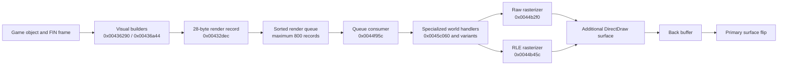

# DC.EXE Rendering and Animation Findings

This document records the Dark Colony executable behavior established while
investigating sprite placement and unit animation in open-rts. It is a focused
technical report, not a complete decompilation. Addresses refer to the exact
executable fingerprint below.

## Executable fingerprint

| Property | Value |
| --- | --- |
| File | `data/DCOLONY/DC.EXE` |
| SHA-256 | `008052f5bc7fadfbf3809187256b000dd0115aaef1ab4fd0a9c26dfe93661f5a` |
| Size | 566,272 bytes |
| Format | PE32, little-endian, i386, Windows GUI |
| Image base | `0x00400000` |
| Compile timestamp | August 11, 1997 20:53:20 |

The file has the normal DOS-compatible PE header, but it is a 32-bit Windows
executable, not a DOS game binary. It is not stripped, although the available
symbols are not sufficient to recover original function names. Embedded assert
strings expose source-unit names including `animate.c`, `juicel.c`, `mobiles.c`,
`objects.c`, `vobj.c`, `engmain.c`, `sprite.c`, `sprites.c`, `collide.c`,
`path.c`, `ai.c`, and `trigger.c`.

The radare2 installation may print a missing `dplayx.sdb` warning while loading
the executable. This only means its DirectPlay type database is unavailable; it
does not prevent code or data analysis.

## Evidence labels

- **Confirmed** means exact instructions and native data agree, or a focused
   test reproduces the result.
- **Inferred** means multiple observations support a conclusion but one native
   boundary remains untraced.
- **Disproven** records an attractive hypothesis contradicted by executable or
   asset evidence.
- **Unknown** identifies behavior that still requires a controlling caller,
   consumer, or runtime trace.

Decompiler variable names and signatures are never evidence by themselves.
The findings below use instruction addresses and call-site register flow where
r2ghidra's inferred parameters are unreliable.

## Rendering architecture

DC.EXE imports `DirectDrawCreate`, but calls the remaining DirectDraw API through
COM vtables. DirectDraw manages display mode, surfaces, palette, presentation,
and some surface-to-surface composition. Normal game sprites are decoded and
rasterized by the CPU into locked surface memory.



### DirectDraw objects

Graphics setup begins around `0x0042bbf0`. Surface setup at `0x0042bdc4`
creates and stores:

| Address | Object |
| --- | --- |
| `0x004745ec` | `IDirectDraw` |
| `0x004745f0` | Primary surface |
| `0x004745f4` | Attached back buffer |
| `0x004745f8` | Additional rendering surface |
| `0x004745fc` | Palette |
| `0x004c1120` | Start of 32 auxiliary-surface pointers |

Confirmed DirectDraw v1 vtable slots are:

| Interface offset | Operation |
| --- | --- |
| `IDirectDraw +0x18` | `CreateSurface` |
| `IDirectDraw +0x50` | `SetCooperativeLevel` |
| `IDirectDraw +0x54` | `SetDisplayMode(640, 480, 8)` |
| `IDirectDrawSurface +0x1c` | `Blt` |
| `IDirectDrawSurface +0x2c` | `Flip` |
| `IDirectDrawSurface +0x30` | `GetAttachedSurface` |
| `IDirectDrawSurface +0x44` | `GetDC` |
| `IDirectDrawSurface +0x64` | `Lock` |
| `IDirectDrawSurface +0x68` | `ReleaseDC` |
| `IDirectDrawSurface +0x74` | `SetColorKey` |
| `IDirectDrawSurface +0x7c` | `SetPalette` |
| `IDirectDrawSurface +0x80` | `Unlock` |

Presentation routine `0x0042b54c` blits the additional surface to the back
buffer, optionally composites one of the auxiliary surfaces, and flips the
primary surface. This is distinct from per-sprite drawing.

### Render queue

Gameplay visual builders at `0x00436290` and `0x00436a44` submit 28-byte
records through `0x00432dec`. The queue has a native limit of 800 records. This
matches the broader executable convention of fixed-capacity object storage;
open-rts preserves `DC_MAX_OBJECTS == 800` and the observed object stride
`DC_OBJECT_SIZE == 0xdc` in its Dark Colony model.

The builder combines the object's fixed-point position with each FIN command
before submitting it. On the normal, non-shaking path, the relevant arithmetic
in `0x00436290` is:

```text
queue_x = object_x + FIN.runtime_x
queue_y = object_z + FIN.runtime_y
```

The secondary visual-object builder at `0x00436a44` performs the same
composition at `0x00436baf..0x00436bd2`: it adds the object's two position
words to the command's runtime X/Y fields before calling `0x00432dec`.

`0x00432dec` converts those values from eighth-pixels and reverses the native
bottom-up Y axis when writing the queue record. Consumer `0x0044f95c` selects a
specialized renderer from record byte `+0x17`. For selector zero it calls
`0x0045c060` normally and `0x0045c41c` for the mirrored form. Together with the
FIN loader's `runtime_x = FIN.x * 8` and `runtime_y = FIN.y * -8`, normal
top-down placement is:

```text
draw_x = object_screen_x + FIN.x + cell.disX
draw_y = object_screen_y + FIN.y - cell.height
```

At `0x0045c0bd..0x0045c0c4`, the normal handler loads `[cell+4]` (`disX`)
and adds it to X. At `0x0045c0df..0x0045c0e3`, it loads `[cell+2]`
(`height`) and subtracts it from Y. It never reads `[cell+6]` (`disY`).
The mirrored handler `0x0045c41c` instead adds cell width to its initial X at
`0x0045c479..0x0045c47f` and supplies a negative horizontal step to the raster
path. Its covered left edge is the FIN X coordinate; an SDL port mirrors within
a width-sized destination at `object_screen_x + FIN.x`, without adding `disX`.
It uses the same `FIN.y - cell.height` top edge at
`0x0045c49a..0x0045c49e`.

The confirmed portion of each 28-byte record written at `0x004dc0ac` is:

| Record offset | Observed value |
| --- | --- |
| `+0x00` | Selected runtime SPR cell pointer |
| `+0x08` | Descending queue sequence key |
| `+0x0c` | Draw X after fixed-point division by eight |
| `+0x0e` | View-height-minus-draw-Y after fixed-point division |
| `+0x12` | Negated object Z after fixed-point division |
| `+0x14..+0x18` | Packed command/render fields |

`0x00432de0` initializes the sequence key from a value rounded down to a
multiple of eight. `0x00432dec` stores that key and decrements it after each
part, preserving order among parts submitted by one animation frame. Consumer
`0x0044f95c` culls, sorts, and dispatches records. Record `+0x17` has observed
values zero through five. The FIN command field at `+0x0c` is copied to this
selector byte; it is a composition selector, not a z-order layer. The FIN
command at `+0x0e` is copied to record byte `+0x18`. Nonzero selectors reach
scaled or remapped handlers
around `0x0045c7b0`, `0x0045cc04`, `0x0045d334`, `0x0045d358`, `0x0045d6d4`,
and `0x0045d6f8`. Selector 5 enters `0x0045d334`, which delegates to
`0x0045d358`. Its setup at `0x0045d3b5..0x0045d3db` adds cell `disX` to the
queued X coordinate and subtracts cell height from the queued Y coordinate.
Thus selector 5 uses the same destination origin formula as selector zero:

```text
draw_x = object_screen_x + FIN.x + cell.disX
draw_y = object_screen_y + FIN.y - cell.height
```

**Confirmed selector-5 composition:** graphics setup `0x0044a7b0` loads exactly
`0x30000` bytes from the active `<tileset>.RMP`, three 256-by-256 byte lookup
tables. Selector-5 wrapper `0x0045d334` advances the table pointer by
`0x10000`, calls `0x0045d358`, and restores the pointer. Scanline compositor
`0x0046387b` reaches generated kernels beginning at `0x00461ab6`; each drawn
pixel reads the destination index into `AL`, the source index into `AH`, then
executes `mov al,[eax]` and writes `AL` back to the destination. The formula is:

```text
destination = RMP[0x10000 + (source << 8) + destination]
```

This is destination-aware indexed-palette composition, not RGBA alpha or
additive blending. The complete semantic names for selectors one through four
remain **unknown**.

**Disproven:** sorting FIN commands numerically by their `layer` field does not
reproduce native depth. It changes authored command order and puts selector-5
dust over the dropship hull. Queue sequence keys preserve FIN order; for
`DROPTWO`, the early cloud/dust/fume commands are intentionally submitted
before the two hull commands.

**Disproven:** the queue was previously reported as reaching dispatcher
`0x0044b5e4` through a callback installed by constructor `0x004297e4`. That
dispatcher exists and its own displacement arithmetic was read correctly, but
it belongs to a separate generic sprite API. It is not the selector-zero world
record consumer. The mistake was plausible because indirect dispatch hides
call references and both paths ultimately use the same raster machinery.

## Native SPR behavior

The SPR loader at `0x0044b048` reads:

1. Header flags, cell count, and payload size.
2. A palette of 256 RGB triplets.
3. One 8-byte descriptor for every cell.
4. Raw or chunked pixel payloads.

An on-disk cell descriptor is:

```c
struct DcSprCellDisk {
    uint16_t width;
    uint16_t height;
    uint16_t dis_x;
    uint16_t dis_y;
};
```

The loader expands this to a 24-byte runtime descriptor containing the four
words, data pointers, a used marker, and decoded or chunk byte counts. Header
flags masked by `0x180` select the chunked/RLE path.

### Generic dispatcher versus world records

Dispatcher `0x0044b5e4` validates the frame index, obtains the runtime cell,
adds both displacement fields to the requested point, clips, and selects the
raw or RLE rasterizer:

```text
draw_x = input_x + cell.disX
draw_y = input_y + cell.disY
```

The relevant instructions load `[cell+4]` for `disX` and `[cell+6]` for
`disY`, then add each to the corresponding draw coordinate before clipping.
This formula is **confirmed for that generic API only**. It must not be applied
to queued world records, whose selector-zero handlers use `disX` and height as
described above. The original purpose of `disY` outside `0x0044b5e4` remains
**unknown**.

The raw rasterizer at `0x0044b2f0` and RLE rasterizer at `0x0044b45c` advance
source and destination scanlines forward. The world handlers establish the top
edge by subtracting height before rasterization; the rasterizers do not perform
a later vertical inversion.

### Native screenshot comparison

Native 640x480 gameplay captures from MobyGames (Dark Colony screenshot
`395046`), My Abandonware's Dark Colony gallery, and the Dark Colony Wiki's
"Active Exploiter" image were compared with production-renderer captures. They
disprove the earlier `FIN.y + disY` implementation: it tears apart the human
landing structure and separates the visible Petra-7 plume from the deployed
Exploiter. Restoring per-cell height subtraction produces the native
top-to-bottom city silhouette and Exploiter relationship. This is supporting
visual evidence; the coordinate rule itself comes from `0x0045c060` and
`0x0045c41c`.

## Native FIN behavior

The FIN loader at `0x004230ac` loads files from `animate/%s`, resolves their SPR
dependencies under `SPRITES/`, reads animation labels and frame metadata, and
expands 22-byte draw commands. Internal error strings call FIN files "juice
files" and label ranges "angles".

Each draw command contains:

```text
char sprite_name[8]
i16  sprite_cell
i16  x
i16  y
i16  remap
i16  intensity
i16  layer
i16  flags
```

The loader converts authored FIN coordinates to fixed render units:

```text
runtime_x = FIN.x * 8
runtime_y = FIN.y * -8
```

The render path later converts these fixed values back while preserving the
authored integer offsets. A displayed part is therefore not defined by its SPR
cell alone. Its identity is the combination of SPR cell, FIN x/y, flip flags,
remap, intensity, and layer.

The exact semantic names of layer values `0`, `1`, `3`, and `5`, and of FIN flag
value `1`, have not yet been proved from every consumer. They should remain
native numeric fields until those paths are traced.

### Frame timing

FIN frame word `+2` is a raw delay. At `0x00423544`, DC.EXE replaces zero with
`15`. Instructions at `0x00423563..0x0042358f` then calculate:

```text
runtime_ticks = ((raw_ticks + 3) * 19) / 100
```

This uses integer arithmetic. For example, the eight frames of `REAPMOVE0`
store:

```text
20, 13, 13, 20, 6, 13, 13, 6
```

They become:

```text
4, 3, 3, 4, 1, 3, 3, 1
```

The varying delays are part of the animation. Replacing them with a uniform
duration makes the cycle look incomplete even when every timeline step is
present. `EXPLMOVE*` uses zero raw delays; zero normalization gives those frames
three runtime ticks.

### Reinforcement dropship

**Confirmed from native assets:** `ANIMATE/DROP.FIN` defines the ten-frame
labels `DROPTWO` (`0..9`), `DROPSTAND0` (`72..81`), and `DROPMOVE0`
(`84..93`). Every `DROPTWO` frame contains both hull cells, `DROP` cells 0 and
1, at independently authored positions. The sequence also composes `DUTS`
(dust), `CLOD` (ground clouds), and `GLIT` (engine fumes and lights) with render
selector 5. The first frame contains 12 commands in authored order, including:

| Part | Cell | FIN position | Selector |
| --- | ---: | --- | ---: |
| `CLOD` | 2 | `(-156,92)` | 5 |
| `DUTS` | 0 | `(-112,85)` | 5 |
| `DROP` | 0 | `(-64,69)` | 1 |
| `DROP` | 1 | `(-64,34)` | 0 |
| `CLOD` | 0 | `(-73,140)` | 5 |

The remaining commands in that frame are a second cloud and five `GLIT`
cells. All ten frames store zero delay, so the confirmed zero-delay rule above
gives three native ticks, or 100 ms at the open-rts 30 Hz simulation rate, per
frame. The complete native cycle is one second.

**Confirmed from DC.EXE:** trigger records are parsed by `0x0043ae2c`, tested by
`0x00439a24`, and executed by `0x0043a144`; the command records begin at
`0x004f744c`. The executor treats the two reinforcement commands differently.
Type 2 (`reinforce`) calls `0x004180b8` to construct a carrier object (native
object type 92 or 93), while type 15 (`reinforce2`) creates the requested units
directly without a carrier.

The five packed words carried by a type-2 trigger are five unit-type/count
pairs, not five coordinates. Carrier action 21 at `0x00417c00` releases one
unit at the carrier's current cell, decrements the active pair, and advances to
the next non-empty pair. If payload remains, it calls the empty-cell finder at
`0x0041a1f4` and sends the carrier to the returned cell before the next release.
The finder checks increasing square radii around the current cell in X-major,
then Y-major order, rejecting non-traversable and occupied cells. Consequently,
release positions depend on current map occupancy and are not a fixed formation.

Carrier action 22 at `0x00417570` controls the arrival/departure flight arc and
uses a 50-tick counter. Construction places the carrier one cell diagonally
adjacent to the scripted destination; two deterministic random bits choose the
sign of the X and Y offsets. The native vertical-arc constants are 600 for the
human type-92 carrier and 1200 for the alien type-93 carrier. The unit-placement
path reached during unloading passes the carrier coordinates to `0x0041a37c`.
In open-rts this maps to a carrier-owned payload controller: each unit is created
at the carrier cell, the next cell is chosen with the same expanding-square
ordering, and the carrier visibly moves between releases.

**Inferred from assets and observed retail behavior:** `DROPTWO` is the active
delivery sequence. `DROPSTAND0` contains hull and engine-light commands but no
`DUTS` or `CLOD`. `DROPMOVE0` contains both ground-effect commands in its FIN
records even though dust is not visible during the observed fly-in/fly-out.
Open-rts therefore uses the movement hull/engine animation while suppressing
`DUTS` and `CLOD` outside the unload phase. Dust is emitted only while
`DROPTWO` is active.

**Disproven:** a reinforcement dropship is not one centered, static
`SPRITES/DROP.SPR` cell. That omits the second hull cell, every authored effect,
FIN placement, command order, native selector composition, and frame progression.
The script's five payload entries are also not authored release offsets, and the
old `index % 2`, `index / 2` rectangle cannot reproduce occupancy-sensitive
native placement.

**Unknown:** the indirect animation callbacks at `0x0042ea58` and `0x0042eaf0`
have not yet exposed the exact action-to-label transitions or proved how native
rendering suppresses the `DUTS`/`CLOD` commands present in `DROPMOVE0`. An
analyzed-string search found no embedded label names; this is consistent with
the loader at `0x004230ac` resolving labels from FIN data. Between-release
movement pacing still needs a runtime trace of the carrier's native movement
record; open-rts currently derives that interval from the authored
`DROPMOVE0` duration rather than inventing another millisecond constant.

Reproduce the executable and implementation checks with:

```sh
radare2 -A data/DCOLONY/DC.EXE
make build/bin/test_game_model_headless
build/bin/test_game_model_headless --game dark-colony
make build/bin/test_dark_colony_sprite_layout
build/bin/test_dark_colony_sprite_layout
```

### Barracks Trooper production

**Confirmed:** Trooper product row 9 in `gamestat/depend.txt` has cost 350,
UI id 89, product class 1, product type 0, and prerequisite `{1}`. The native
dependency path checks affordability before emitting the build request. In
open-rts, clicking the darkened Trooper icon with less than 350 Petra-7 is
therefore expected to do nothing; hovering the icon shows `Trooper 350` in red.

The release visual is label `TRSCBUILD0` in `ANIMATE/HUBU.FIN`. It contains 22
frames, each with raw delay 6. Applying the executable's conversion above gives
one native 19 Hz runtime tick per frame, so the complete release lasts 22 native
ticks, approximately 1.16 seconds. Open-rts runs at 30 Hz and represents the
same elapsed time with 35 cumulatively rounded simulation ticks. Copying raw 6
directly into each state made the release 4.4 seconds long; treating the 22
native ticks as 22 open-rts ticks made it too fast at approximately 733 ms.

The FIN-authored sequence is:

| Release frames | Visible parts | FIN positions |
| --- | --- | --- |
| 1-3 | HUBU cells 12, 13, 14 | `(-36,27)` |
| 4-9 | HUBU cell 15 plus TRSC cells 72, 16, 24, 32, 40, 48 | HUBU `(-36,27)`; TRSC `(-156,36..58)` |
| 10-12 | HUBU cells 14, 13, 12 plus TRSC cells 56, 64, 72 | HUBU `(-36,27)`; TRSC `(-156,57..59)` |
| 13-18 | TRSC cells 16, 24, 32, 40, 48, 56 | `(-156,68..79)` |
| 19-22 | TRSC cells 8, 1, 2, 18 | `(-155,78)`, `(-154,80)`, `(-153,79)`, `(-143,79)` |

The normal south-facing Trooper standing command is at `(-159,0)`. The live
unit handoff must preserve the final release image on screen, so its world
offset from the Barracks origin is the command delta:

```text
x = -143 - (-159) = +16 pixels
y = -(79 - 0)      = -79 pixels
```

The Y negation is the existing FIN-top-left to Y-up world conversion. This is
the source of the open-rts spawn offset; it is not a guessed free-cell radius.

At `0x00438c95..0x00438d16`, the native object-type loader searches first for
`BUILDSTAND`, then `BUILD`, and stores the resulting animation pointer at type
offset `+0x98`. At `0x00441430..0x00441450`, the city/object setup path can
initialize an object's animation directly from that `+0x98` pointer and return
before ordinary city-slot placement. This confirms a dedicated build-animation
initialization path rather than a generic sprite overlay. Open-rts must replace
the Barracks standing state with this chain and return to the standing state at
completion; drawing the chain as an effect leaves the closed Barracks underneath
and produces two overlapping doors. The exact caller-side
condition that distinguishes every construction and troop-release case remains
**inferred** because the large scenario loader supplies its arguments through
registers and several call sites.

The player/AI dependency path calls `0x0040bbe8` after cost deduction. That
routine creates a 7-byte network message with opcode `0x0a`; the literal 7 is
the message length, not an action type. Treating it as “action type 7” is
**disproven**.

**Unknown:** no executable-backed Trooper training countdown was established in
this pass. Open-rts currently uses `cost * 10 ms`, or 3.5 seconds for a Trooper;
that is a heuristic and must not be described as a DC 1:1 value. Likewise, the
open-rts 2.75-cell crowd selection and 1.5-cell doorway-clearing move are not
yet supported by this disassembly. Native queue progression, blocked-exit
behavior, and any rally/spacing command require tracing the opcode `0x0a`
consumer and the completion callback.

## Directional animation

Function `0x00423a50` constructs directional animation sets:

1. It concatenates the unit stem and state keyword using `%s%s` at
   `0x0046fccc`.
2. It probes 16 numbered labels using `%s%d` at `0x0046fcd4`.
3. The probed suffix is `(12 - index) & 15`.
4. It expands the 16 results into a 32-entry heading table.
5. Missing labels use a nearby available angle selected through the fallback
   table at `0x00474500`.

This establishes that odd-numbered angle labels are real runtime inputs, not
discarded editor data. State keywords visible near the unit-definition loader
include `MOVE`, `STAND`, `DIEA`, `DIEB`, `DIEC`, `DEPLOY`, `FUNK`,
`BUILDSTAND`, `BUILD`, `SCRCH`, `BURN`, and `BLOOD%c`.

### Reaper

`REAP.FIN` has eight principal movement ranges with eight timeline frames each:

| Label | Inclusive FIN frames |
| --- | --- |
| `REAPMOVE0` | `16..23` |
| `REAPMOVE14` | `24..31` |
| `REAPMOVE12` | `32..39` |
| `REAPMOVE10` | `40..47` |
| `REAPMOVE8` | `48..55` |
| `REAPMOVE2` | `56..63` |
| `REAPMOVE4` | `64..71` |
| `REAPMOVE6` | `72..79` |

Odd `REAPMOVE1/3/.../15` labels contain single intermediate-angle poses. Fire
ranges contain five frames. Death ranges vary and contain 10, 11, 14, 15, 26,
or 27 frames depending on direction.

The even-direction walk cycles deliberately reuse cells with different flags
and offsets. `REAPMOVE0` contains:

```text
9, 17, 25, 33, 9 flipped, 17 flipped, 25 flipped, 33 flipped
```

The flipped half has x offsets around `-24`, while the unflipped half has offsets
around `-157`. Counting unique SPR cell numbers yields only four, but DC.EXE
displays an eight-step cycle because flip state, FIN offset, and timing are all
part of each step. Mirroring an already-normalized canvas around its center is
not equivalent to this behavior.

### Direction-code orientation

**Inferred:** Dark Colony's 16-way FIN direction codes use `0 = south` and
increase counterclockwise: `4 = east`, `8 = north`, and `12 = west`. Treating
code zero as north reverses only vertical sprite facings while horizontal
facings remain correct, matching the observed Trooper failure. Open-rts maps
these native codes to its Doom-style angles with south as the first angle and
counterclockwise progression; movement vectors remain in native Y-up world
coordinates.

The focused cardinal regression and Human01-Human03 model scenarios reproduce
the result:

```sh
make build/bin/test_game_model_headless
build/bin/test_game_model_headless
```

The exact DC.EXE routine that converts movement deltas to FIN direction codes
remains **unknown** and should be traced before promoting this from inferred to
confirmed.

### Exploiter

`EXPL.FIN` also supplies all 16 directional poses:

- Even `EXPLSTAND*` labels provide the principal standing facings.
- Odd `EXPLSHUF1/3/.../15` labels provide intermediate poses.
- Even `EXPLMOVE0/2/.../14` labels provide two-frame movement cycles.
- Later odd `EXPLMOVE1/3/.../15` labels provide one-frame poses.

Open-rts emits all 16 direction codes for Exploiter stand and run states. The
standing state alternates the even `EXPLSTAND*` and odd `EXPLSHUF*` labels;
these resolve to `EXPL.SPR` frames `0,1,2,3,4,5,6,7,8,7,6,5,4,3,2,1`, with
the final seven slots flipped as directed by the FIN commands. Run state 1 uses
frames `0,1,2,3,4,5,6,7,8,7,6,5,4,3,2,1`; run state 2 uses
`9,1,10,3,11,5,12,7,13,7,12,5,11,3,10,1`. Thus even `EXPLMOVE*` headings
animate through two frames while each odd heading retains its native one-frame
pose. Deploy remains eight-way because harvesting explicitly rotates the unit
to direction code 6 before entering that animation.

It remains unresolved whether DC.EXE selects `SHUF` specifically during a
turn-in-place transition and the later odd `MOVE` set during translation, or
uses another gameplay distinction. That question belongs to callers of the
animation-set constructor, not to the generic renderer.

The deployed harvesting light is **confirmed** by `EDPLYSTAND14` in
`EXPL.FIN`, frames 52 and 53. Both frames draw the deployed body as EXPL cell
34 at `(-159,25)`. Frame 52 additionally draws horizontally flipped GLIT cell
10 at `(-13,-39)`, layer 5, remap 0, intensity 16; frame 53 omits the GLIT
part. Their raw durations are 6 and 0 (the latter uses the 15-tick fallback),
which convert cumulatively to two and four 30 Hz simulation tics. The resulting
two-state loop blinks the light at the top of the deployed mast. The previously
constructed 15-state cycle from deploy/retract top cells was **disproven** by
the retail harvesting reference: those cells animate the probe deployment, not
the working light.

## Consequences for open-rts

The executable evidence gives several implementation rules:

1. For selector-zero queued world sprites, apply `disX` only when unmirrored
   and subtract cell height from Y; do not apply `disY`.
2. Preserve FIN x/y independently for every body and overlay part.
3. Treat a frame as cell plus flags, offsets, remap, intensity, and layer.
4. Preserve converted per-frame FIN timing rather than assigning one duration
   to an entire sequence.
5. Preserve 16-angle labels where the assets provide them.
6. Implement missing-angle selection as animation-table behavior, not as a
   sprite-name-specific rendering exception.
7. Keep the fixed render queue and native object-layout limits visible while
   reconstructing behavior.

These findings rule out moving terrain, gameplay coordinates, or city slots to
compensate for sprite misalignment. Visual corrections should reproduce the
specialized queue handler selected by the native render record.

DC.EXE does contain literal city-slot geometry at `0x00475b64`:
`(-64,15)`, `(0,0)`, `(32,64)`, `(64,10)`, `(-32,65)`, `(0,32)`, and `(0,0)`.
Function `0x004412d4` multiplies each component by eight and adds it to the city
anchor before writing object `x_pos` and `z_pos`. These scattered coordinates
are the native gameplay and occupancy positions, not the FIN animation origins.

The native city object anchor is the second `%AISlots` pair. The scenario loader
stores that pair in team fields `+0x2c/+0x30`; `0x00441468..0x004414b3` shifts
both values left by eight and adds the corresponding slot-table component
shifted left by three. The values are object origins, not cell centers. For
Human02 this makes the native object origin `(56,55)`.

This is a building-specific coordinate convention, but it is **not** a
city-only `Y + 0.5` adjustment. The mobile-object constructor in `mobiles.c`,
function `0x00419d44`, converts both integer cell coordinates to cell centers:

```text
0x00419f1a..0x00419f29: x_pos = (cell_x << 8) + 0x80
0x00419f33..0x00419f3e: z_pos = (cell_z << 8) + 0x80
```

The city constructor instead omits `0x80` from both axes. City buildings are
therefore special because gameplay uses exact object origins and the city slot
table, while ordinary mobiles use centered cells. The visual path has an
additional city-specific step: for object indices below 120 whose slot modulo
15 is below six, `0x0043654f..0x00436567` calls `0x00441080` to recover that
slot's table offset multiplied by eight. Queue construction then computes:

```text
0x00436662..0x00436675: draw_z = object_z - slot_z * 8 + FIN.runtime_y
0x0043667c..0x00436687: draw_x = object_x - slot_x * 8 + FIN.runtime_x
```

Because construction added the same offsets, all city FIN animations share the
second `%AISlots` origin while their gameplay objects remain scattered. The
sort-key setup at `0x004365a7..0x004365c0` still receives raw object Z before
the subtraction. `TOWR.FIN` then supplies its ordinary pixel command offset
`(-36,-9)` relative to the shared origin.

**Disproven:** retail city location `(x, y + 0.5)`. For Human02, DC.EXE stores
the TOWR city object at `(56,55)` before its slot offset, not `(56,55.5)` or a
mixed `(56,53.5)` anchor. This can be reproduced with:

```sh
r2 -q -e bin.cache=true -A -c "pd 30 @ 0x00441457" -c q data/DCOLONY/DC.EXE
r2 -q -e bin.cache=true -A -c "pd 24 @ 0x00419f10" -c q data/DCOLONY/DC.EXE
```

Open-rts previously replaced the native shared render origin with a mixed anchor
assembled from the second `%AISlots` X and centered first `%AISlots` Y. For
Human02 that produced `(56,53.5)`. That mixed anchor had no executable basis and
has been removed. Open-rts now preserves each scattered object coordinate and
subtracts only its native slot offset for rendering, leaving the shared visual
origin at the native `(56,55)`. A one-tile downward sprite offset aligns that
integer boundary with the terrain row without rewriting the model coordinate.

The final one-row presentation offset is **inferred** from the renderer boundary
and retail screenshot comparison, not an additional subtraction found in the
city constructor. It is the same class of bottom-up row/point mismatch as the
Human02 vent: scenario and model coordinates remain native while rendering
accounts for the integer boundary convention.

`VENT.FIN` provides the active Petra-7 glow placement. Every `VENTSTAND0` frame
contains VENT2 cell 0 at FIN coordinate `(-40,12)`, remap `1`, intensity `16`,
layer `0`, and flags `0`. VENT2 cell 0 has width 23, height 16, and displacement
`(31,37)`. Native screenshot comparison shows that applying the selector-zero
world formula to this remapped command places the glow 29 pixels above its
terrain-baked crater. The generic displaced placement gives destination offset
`(-9,25)` from the animation origin:

```text
x = -40 + 31 = -9
y = -12 + 37 = 25
```

Open-rts's decoration API stores a pivot that is subtracted from the world
anchor. Its VENT2 adapter therefore stores pivot `(9,-25)`, the negation of
that destination offset. Treating the command as selector zero produced pivot
`(9,4)` and placed the plume 29 pixels too high. The exact native selector
chosen by remap/layer packing remains unknown; this correction is inferred from
the preserved FIN/SPR metadata and native screenshot alignment rather than a
fully traced nonzero queue handler.

The yellow smoke above an unattached vent is a separate `PUFF.SPR` part, not an
animation within `VENT2.SPR`. This is **confirmed** by `VENT.FIN`: label
`VENTSTAND0` spans FIN frames 19 through 38 and advances the puff through cells
`0, 0, 1, ..., 18`. The first puff command is at `(-39,6)`, remap `0`, while
the remaining commands use remap `2` and rise to Y `-17`. The underlying VENT2
cell remains fixed at `(-40,12)` throughout the sequence. The first two FIN
frames have raw duration 26; the remaining zero durations use the established
15-tick fallback. With the generator's FIN-to-runtime conversion, these become
five and three 30 Hz simulation tics respectively, giving an approximately
100 ms frame cadence for most of the loop. Reproduce with the FIN parser in
`tests/test_dark_colony_sprite_layout.c` against
`data/DCOLONY/ANIMATE/VENT.FIN` and the raw cell descriptors in
`data/DCOLONY/SPRITES/PUFF.SPR`.

Each PUFF cell uses its own FIN coordinate and SPR displacement. Retail
screenshot comparison disproves applying the selector-zero `Y - height`
formula to this remapped part: that moved the complete puff progressively too
high above the crater. The remapped placement `-FIN.y + disY` keeps the puff's
top near the vent while its changing cell artwork supplies the smoke motion:

```text
19, 19, 20, 17, 16, 17, 14, 11, 12, 14,
15, 15, 15, 15, 16, 17, 18, 24, 26, 28
```

Open-rts stores the authored cell, remapped world-render pivot, and converted
duration for each FIN frame. The first two steps last 167 ms and the remaining
steps last 100 ms. The placement is **inferred** from the FIN/SPR metadata and
retail screenshot; the composition behavior is confirmed separately below.

Smoke composition is **confirmed** from the FIN fields and selector-5 renderer.
Every `VENTSTAND0` puff uses intensity 16, selector 5, and flags 0. The first two
steps use remap 0 and the remaining primary puff commands use remap 2. Intensity
16 reaches `0x0045d6f8` through `ECX` and seeds raster state at `0x0045d715`,
but the generated drawn-pixel kernels overwrite the corresponding source-index
byte; its remaining role is **unknown** and it is not evidence for scalar
opacity. Selector-5 wrapper `0x0045d6d4` selects the second 256-by-256 table from
the active tileset `.RMP`. Therefore the smoke has no scalar RGBA opacity: each
nontransparent source palette index and existing destination palette index
select a replacement destination index. Open-rts must use this indexed
composition and must not approximate it with additive blending, a yellow color
modulation, or a fixed alpha.

**Correction (2026-09-01):** the first implementation and its regression test
still used the disproven selector-zero `FIN.y - height` expression even though
the finding above recorded the remapped `-FIN.y + disY` placement. This made the
stored pivot grow from 4 to 54 pixels, so the renderer lifted the entire puff by
nearly one 64-pixel map row. `RTS_WORLD_Y_UP` did not prevent this: that option
converts world/map Y before projection, while FIN coordinates, SPR displacement,
and decoration pivots are screen-space pixels applied after projection. The
adapter now stores pivot Y as `FIN.y - disY`, the negation required by the
renderer, and the focused test asserts the native destination expression rather
than duplicating the incorrect runtime formula.

Retail observation shows this smoke loop only while no Exploiter is attached.
That behavior is **observed**, while the DC.EXE branch that suppresses the
smoke remains **unknown**. Open-rts therefore tracks the puff separately from
the persistent VENT2 glow and hides it whenever a live harvester targeting the
vent is in its mining phase; it becomes visible again when the harvester
leaves. This avoids incorrectly removing the vent itself during a return trip.

The routine at `0x004128c4` confirms that Dark Colony uses the shared object and
occupancy system rather than sprite bounds for interaction. At
`0x004128f6..0x00412904` it reads 8.8 fixed-point `x_pos` and `z_pos` fields at
offsets `+0x00/+0x04`, shifts both right by eight, and looks up the object in
that map cell. This is a validation/interaction path, not evidence that an
approaching unit must stop on the first sub-cell position inside the tile.

At `0x00412b0d..0x00412b20`, the same routine changes a human Exploiter object
from GAMESTAT type `6` (`EXPL`) to type `47` (`EDPLY`); the alien harvester
equivalently changes from type `14` to type `48`. It then starts the replacement
type's animation without writing either position field. Deployment is therefore
an in-place object-type/state transition. The native renderer continues to use
the preserved object origin with the new type's FIN/SPR frame parts.

The first-entry interpretation was **disproven** by the resulting visible
one-cell separation between the Exploiter and vent. A grid-and-anchor capture of
Human02 showed that the active crater/plume occupies the map row immediately
below the raw scenario object's row: scenario vent `(69,48)` has its visual
interaction center at `(69.5,47.5)`. Open-rts preserves `(69,48)` as the vent's
script identity and stores `(69.5,47.5)` as its attachment point. Movement and
the harvesting distance check both use that attachment point. This correction
is **inferred** from the scenario/map composition and rendered grid; the native
order/path routine that transforms a clicked vent into its stop point remains
untraced. No gameplay coordinate is derived from EXPL frame bounds.

## In-game HUD text, money, and day counter

The in-game interface is data-driven by `data/DCOLONY/INTRFACE/MAINE`. This is
**confirmed** by the native definition and the executable's interface/font
setup. `0x00432d28` passes `intrface/mfont` to the font loader at `0x0044b048`;
`MAINE` selects `intrface/mfonto7`, declares character offset 31, and uses the
native 640x480 coordinate space.

The three lower-HUD controls are:

| Control | Native definition | Meaning |
| --- | --- | --- |
| `75` | `scount`, `(524,456)`, `72x17`, `MAINBUT` frame 104, intensity 31 | Player money |
| `148` | `in_text`, `(50,462)`, 61 characters, remap 2, intensity 31 | Current script message |
| `234` | `in_text`, centered at `(613,433)`, 3 characters, remap 0, intensity 31 | Day counter |

The `DAYS` label and containing panels are part of `INTRFACE.GIF`; the game
does not draw replacement rectangles behind these controls. Font remap 2 gives
the bottom message its yellow color. Remap 0 is a real palette remap, not an
identity/no-remap sentinel: team-color indices 138 through 143 shift by
`(remap - 7) * 6`, so remap 0 supplies the red day digits while remap 7 is the
identity/cyan band.

Money wiring is **confirmed** at `0x0040a6ea..0x0040a70f`. The routine selects
the current player's 3632-byte team record, reads its money at record offset
`+0xbac`, puts control ID 75 in `edx`, and calls `0x004285cc` to update the
`scount`. The frame-104 artwork and decimal value therefore belong in the
single native money control; the adjacent day panel is not a vent count.

The day formula is **confirmed** in `0x00437824`:

```text
days = total_simulation_tics / scenario_day_rate / 2
text = sprintf("%3.3d", days)
set_text(control_id = 234, text)
```

The total tic field at game-state offset `+0x52c` is initialized to zero at
`0x0041a9a5` and incremented once per simulation update at
`0x004189d0..0x004189e1`. The divisor at `+0x534` is loaded from the SCN header
at `0x0041a975`; it is the fourth flattened header value (6300 in HUMAN02).
Thus HUMAN02 advances the displayed day once every 12,600 simulation tics.
The output is three zero-padded digits, even when a screenshot's narrow glyphs
make `000` resemble two digits.

Scenario messages are also **confirmed** as indexed script text rather than
hardcoded HUD strings. HUMAN02's `.TRO` begins with `msg 2 0 1 3 8`, selecting
message 1 from `HUMAN02.MSG` (`APPROACHING BASE...PREPARE FOR LANDING`). At
`0x00448f60`, DC.EXE validates the index against a 30-entry `mtext[]` table,
appends the selected pointer and metadata to a 16-entry message history, and
stores intensity 31. Trigger processing calls this routine at `0x0043a20b`.
`MAINE` also defines Last Msg and Next Msg buttons (IDs 147 and 149), confirming
that mission text persists as navigable history rather than expiring after a
short fixed timeout.

The nearby `%d/%d` formatter at `0x004342a7` was investigated and is
**disproven** as a HUD resource/day formatter. It formats fields from an object
record in the large routine at `0x00433acc` and sends the result through an
object-text path at `0x0042f298`; it does not update controls 75 or 234.

Reproduce the native-data evidence with:

```sh
sed -n '285,445p' data/DCOLONY/INTRFACE/MAINE
sed -n '1,15p' data/DCOLONY/SCENARIO/HUMAN/HUMAN02.TRO
sed -n '1,8p' data/DCOLONY/SCENARIO/HUMAN/HUMAN02.MSG
r2 -q -e bin.cache=true -A -c "pd 80 @ 0x00437820" -c q data/DCOLONY/DC.EXE
r2 -q -e bin.cache=true -A -c "pd 40 @ 0x0040a6ea" -c q data/DCOLONY/DC.EXE
r2 -q -e bin.cache=true -A -c "pdf @ 0x00448f60" -c q data/DCOLONY/DC.EXE
env SDL_VIDEODRIVER=dummy build/bin/dark-colony --screenshot /private/tmp/dc-hud.bmp data/DCOLONY SCENARIO/HUMAN/HUMAN02.MAP SPRITES/TROOPER1.SPR
```

## Known unknowns

## Combat flash, blood, and ground illumination (2026-09-01)

**Confirmed.** The reference executable is `data/DCOLONY/DC.EXE`, PE32/i386,
566272 bytes, stamped 1997-08-11 (the fingerprint was obtained with
`rabin2 -I`). Its native animation data is external: the combat visuals are
provided by the FIN command tables and the companion SPR files, rather than
embedded in the executable.

**Confirmed from native data.** The FIN fire labels use layer-3 `BLAZ` commands
for the bright muzzle attachment. The existing FIN extraction path selects the
nearest following layer-3 command after the layer-1 body command and preserves
its per-direction x/y placement. `BLOO.SPR` is a separately referenced combat
effect sprite; the animation tables also contain `HIT*` and `BLOOD%c` effect
families for other reactions. This is why the runtime uses `BLAZ.SPR` for the
short muzzle flash and `BLOO.SPR` at the damaged unit, instead of drawing a
placeholder shape.

**Implementation consequence.** Dark Colony actor defaults now name the native
flash and blood assets for every combat actor, including actors whose generated
body state table does not yet expose a missile state. Each attack also creates
a short-lived additive ground-light record at the attacker's map origin. The
light is rendered as a fading, flattened ground glow in screen space; it does
not move the unit or alter FIN attachment coordinates. A focused reproduction
is:

```sh
make build/bin/dark-colony
env SDL_VIDEODRIVER=dummy build/bin/dark-colony --check --game dark-colony
```

**Inferred.** The exact native lighting primitive is not yet isolated in
`DC.EXE`; the ground glow is therefore a renderer-side approximation of the
visible muzzle illumination, while the BLAZ/BLOO asset selection and FIN muzzle
placement are native-data-derived.

## Mechanical death explosions (2026-09-01)

**Confirmed.** The generated Reaper death states contain two special FIN-derived
effect chains: `REAPDIEA14` and `REAPDIEA6`. Their layer-5 commands reference
`BLAM.SPR` frames `0..17`; the selected chain depends on the unit's facing.
`A_DC_ReaperDeath` performs this selection and spawns the state effect before
transitioning the Reaper into its normal death/corpse handling. The other
currently generated `BARRDIE`, `SARGDIE`, and `SCGMDIE` tables contain no
equivalent `BLAM` chain, so they are not classified as explosion-capable by this
change.

**Implementation consequence.** The Reaper's native death action is now stored
in its actor definition and invoked by the generic damage/death path as well as
the state-machine path. This preserves the DC angle selection when a Reaper is
killed by the current combat loop.

## AI / Krusty attack logic (2026-09-01)

**Confirmed.** `DC.EXE` is the PE32/i386 executable fingerprinted above. Its
embedded diagnostics identify `ai.c` (`AI Game State`) and `krusty_attack.c`
(`Krusty AI`, `best_slot!=-1`, and `AI Path not found (hsm)`). This is native
executable evidence, not a reconstruction from a strategy-game article.

**Confirmed.** Initialization routine `0x00447740` creates per-side AI state
with a stride of `0xe30` bytes, clears an 800-entry object-slot table at state
offset `0x1200`, marks the active side at `0x6c38`, installs helper subsystems,
and seeds behavior values at `0x6c14..0x6c30` (`0xc0, 1, 1, 2, 4, 2, 4, 2`).
It then copies 18 three-word records from a global table in `0x00451a9c`.
The values' semantic names are not proven, but the 800-slot and per-side
layout are clear.

**Confirmed.** `0x00452c10` updates two per-zone byte flags by setting and
clearing bits `0x02` and `0x04`; it validates a nonzero object zone through
the `krusty_attack.c` assertions. `0x004536c0` scans 256 candidate entries,
calls `0x00447090` to score each live candidate, and retains the lowest score;
the assertion at line 368 proves this is a best-slot selection pass.
`0x004538f4` orchestrates additional candidate filtering and calls
`0x00452e10`, whose 256-word temporary table and object-field comparisons are
consistent with target/zone allocation. Exact field meanings remain unknown.

**Inferred.** DC's combat AI is a periodic zone/slot allocator and attack
selector, not a general-purpose behavior-tree system. Porting its raw state
layout would couple the engine to DC's 800-object pool and hidden path-network
structures. The implementation therefore keeps the observable policy in the
simulation: scenario `%AI` enables a deterministic, batched attack thinker;
each AI unit scores hostile attack-capable and mobile targets with distance as
the stable tie-break, assigns the selected target, and uses the engine path
finder to pursue it. The first generic-player layer adds a five-second attack
wave target, a base-defense override, and configurable aggression/defense
radius. `DarkColonyAiConfig` in `p_spec.c` is the configuration seam for future
decoded eagerness, target weights, and production priorities.

**Implementation consequence.** The generic AI player now reuses the shared
resource and production systems rather than maintaining a parallel economy.
Idle AI harvesters are assigned to the nearest active vent through
`P_HarvestUnitTo`, so cargo return and resource ownership remain engine rules.
The model-layer production controller spends owner-1 resources through the
normal prerequisite and maker checks, queues units through the normal producer
queue, and follows a configurable default progression of Barracks, Sci-Pod,
Robo-Ftr, Exploiters, Troopers, Reapers, Osprey IV, and S.A.R.G.E. This is a
generic competent-player policy, not a claim that the opaque DC production AI
has been fully recovered.

**Unknown.** The native build/production policy, exact dependency-table
semantics (`depend.c`, `gamestat/depend.txt`, and `gamestat/unitid.txt`), zone
construction, and the `hsm` path routine have not yet been decoded. No claim is
made that the current first pass reproduces native unit purchasing or resource
spending.

- The complete semantics and ordering rules for every FIN layer value.
- The exact meaning of all FIN flag bits beyond observed horizontal flipping.
- Which gameplay transition chooses Exploiter `SHUF` versus odd `MOVE` poses.
- The complete sort-key layout of the 28-byte render queue record.
- The role of each of the 32 auxiliary DirectDraw surfaces.
- The native order/path routine that decides the exact Exploiter stop position
   before the interaction handler runs.
- Whether `DC16.EXE` uses identical routines and addresses; this report covers
  the fingerprinted `DC.EXE` only.

## Reproducing the analysis

Follow the workflow in `REVERSE_ENGINEERING.md`. Useful starting commands are:

```sh
rabin2 -I data/DCOLONY/DC.EXE
r2 -q -e bin.cache=true -A -c "pdf @ 0x0044b5e4" -c q data/DCOLONY/DC.EXE
r2 -q -e bin.cache=true -A -c "pdf @ 0x004230ac" -c q data/DCOLONY/DC.EXE
r2 -q -e bin.cache=true -A -c "pdf @ 0x00423a50" -c q data/DCOLONY/DC.EXE
r2 -q -e bin.cache=true -A -c "pdf @ 0x0042b54c" -c q data/DCOLONY/DC.EXE
r2 -q -e bin.cache=true -A -c "pdf @ 0x00432dec" -c q data/DCOLONY/DC.EXE
r2 -q -e bin.cache=true -A -c "pdf @ 0x00436290" -c q data/DCOLONY/DC.EXE
r2 -q -e bin.cache=true -A -c "pdf @ 0x00436a44" -c q data/DCOLONY/DC.EXE
r2 -q -e bin.cache=true -A -c "pdf @ 0x00437824" -c q data/DCOLONY/DC.EXE
r2 -q -e bin.cache=true -A -c "pdf @ 0x00448f60" -c q data/DCOLONY/DC.EXE
r2 -q -e bin.cache=true -A -c "pdf @ 0x0044f95c" -c q data/DCOLONY/DC.EXE
r2 -q -e bin.cache=true -A -c "pdf @ 0x0045c060" -c q data/DCOLONY/DC.EXE
r2 -q -e bin.cache=true -A -c "pdf @ 0x0045c41c" -c q data/DCOLONY/DC.EXE
```

Decompiler signatures and variable names are provisional. Verify conclusions
against exact instructions, callers, native SPR/FIN bytes, and visible game
behavior before porting them.

## Selection marker and HUMAN02 reinforcements

**Confirmed from native SPR data:** the Dark Colony selection marker is the
`INTRFACE/CLIENT.SPR` command family. Its inspected marker cells have zero
displacement, so the marker belongs to the unit's stable world anchor rather
than the visible top edge of the current body frame. open-rts now places it
from the unit anchor and body destination offset, avoiding animation-frame
drift.

**Confirmed from `HUMAN02.TRO`:** `reinforce` arguments after team and map
position are `(native unit type, count)` pairs. The first drop expands to
native types `69 x1`, `6 x1`, and `0 x3`. Type 69 is a TRSC variant with the
same body sprite but distinct native weapon and defense statistics. The model
retains the native type id while using the shared TRSC actor for rendering and
common behavior.

**Inferred implementation behavior:** the drop script supplies a landing point
and payload, but no per-unit final formation coordinates. open-rts keeps the
dropship at that point during unload and assigns deterministic walkable slots
around it; blocked or occupied slots fall back to the landing cell. The native
per-unit movement or rally command remains unknown.
