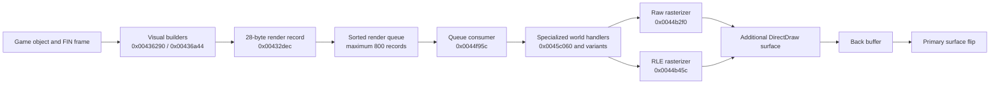

# DC.EXE Rendering and Animation Findings

This document records the Dark Colony executable behavior established while
investigating sprite placement and unit animation in open-rts. It is a focused
technical report, not a complete decompilation. Addresses refer to the exact
executable fingerprint below.

## Executable fingerprint

| Property | Value |
| --- | --- |
| File | `data/DCOLONY/DC.EXE` |
| SHA-256 | `008052f5bc7fadfbf3809187256b000dd0115aaef1ab4fd0a9c26dfe93661f5a` |
| Size | 566,272 bytes |
| Format | PE32, little-endian, i386, Windows GUI |
| Image base | `0x00400000` |
| Compile timestamp | August 11, 1997 20:53:20 |

The file has the normal DOS-compatible PE header, but it is a 32-bit Windows
executable, not a DOS game binary. It is not stripped, although the available
symbols are not sufficient to recover original function names. Embedded assert
strings expose source-unit names including `animate.c`, `juicel.c`, `mobiles.c`,
`objects.c`, `vobj.c`, `engmain.c`, `sprite.c`, `sprites.c`, `collide.c`,
`path.c`, `ai.c`, and `trigger.c`.

The radare2 installation may print a missing `dplayx.sdb` warning while loading
the executable. This only means its DirectPlay type database is unavailable; it
does not prevent code or data analysis.

## Evidence labels

- **Confirmed** means exact instructions and native data agree, or a focused
   test reproduces the result.
- **Inferred** means multiple observations support a conclusion but one native
   boundary remains untraced.
- **Disproven** records an attractive hypothesis contradicted by executable or
   asset evidence.
- **Unknown** identifies behavior that still requires a controlling caller,
   consumer, or runtime trace.

Decompiler variable names and signatures are never evidence by themselves.
The findings below use instruction addresses and call-site register flow where
r2ghidra's inferred parameters are unreliable.

## Rendering architecture

DC.EXE imports `DirectDrawCreate`, but calls the remaining DirectDraw API through
COM vtables. DirectDraw manages display mode, surfaces, palette, presentation,
and some surface-to-surface composition. Normal game sprites are decoded and
rasterized by the CPU into locked surface memory.



### DirectDraw objects

Graphics setup begins around `0x0042bbf0`. Surface setup at `0x0042bdc4`
creates and stores:

| Address | Object |
| --- | --- |
| `0x004745ec` | `IDirectDraw` |
| `0x004745f0` | Primary surface |
| `0x004745f4` | Attached back buffer |
| `0x004745f8` | Additional rendering surface |
| `0x004745fc` | Palette |
| `0x004c1120` | Start of 32 auxiliary-surface pointers |

Confirmed DirectDraw v1 vtable slots are:

| Interface offset | Operation |
| --- | --- |
| `IDirectDraw +0x18` | `CreateSurface` |
| `IDirectDraw +0x50` | `SetCooperativeLevel` |
| `IDirectDraw +0x54` | `SetDisplayMode(640, 480, 8)` |
| `IDirectDrawSurface +0x1c` | `Blt` |
| `IDirectDrawSurface +0x2c` | `Flip` |
| `IDirectDrawSurface +0x30` | `GetAttachedSurface` |
| `IDirectDrawSurface +0x44` | `GetDC` |
| `IDirectDrawSurface +0x64` | `Lock` |
| `IDirectDrawSurface +0x68` | `ReleaseDC` |
| `IDirectDrawSurface +0x74` | `SetColorKey` |
| `IDirectDrawSurface +0x7c` | `SetPalette` |
| `IDirectDrawSurface +0x80` | `Unlock` |

Presentation routine `0x0042b54c` blits the additional surface to the back
buffer, optionally composites one of the auxiliary surfaces, and flips the
primary surface. This is distinct from per-sprite drawing.

### Render queue

Gameplay visual builders at `0x00436290` and `0x00436a44` submit 28-byte
records through `0x00432dec`. The queue has a native limit of 800 records. This
matches the broader executable convention of fixed-capacity object storage;
open-rts preserves `DC_MAX_OBJECTS == 800` and the observed object stride
`DC_OBJECT_SIZE == 0xdc` in its Dark Colony model.

The builder combines the object's fixed-point position with each FIN command
before submitting it. On the normal, non-shaking path, the relevant arithmetic
in `0x00436290` is:

```text
queue_x = object_x + FIN.runtime_x
queue_y = object_z + FIN.runtime_y
```

The secondary visual-object builder at `0x00436a44` performs the same
composition at `0x00436baf..0x00436bd2`: it adds the object's two position
words to the command's runtime X/Y fields before calling `0x00432dec`.

`0x00432dec` converts those values from eighth-pixels and reverses the native
bottom-up Y axis when writing the queue record. Consumer `0x0044f95c` selects a
specialized renderer from record byte `+0x17`. For selector zero it calls
`0x0045c060` normally and `0x0045c41c` for the mirrored form. Together with the
FIN loader's `runtime_x = FIN.x * 8` and `runtime_y = FIN.y * -8`, normal
top-down placement is:

```text
draw_x = object_screen_x + FIN.x + cell.disX
draw_y = object_screen_y + FIN.y - cell.height
```

At `0x0045c0bd..0x0045c0c4`, the normal handler loads `[cell+4]` (`disX`)
and adds it to X. At `0x0045c0df..0x0045c0e3`, it loads `[cell+2]`
(`height`) and subtracts it from Y. It never reads `[cell+6]` (`disY`).
The mirrored handler `0x0045c41c` instead adds cell width to its initial X at
`0x0045c479..0x0045c47f` and supplies a negative horizontal step to the raster
path. Its covered left edge is the FIN X coordinate; an SDL port mirrors within
a width-sized destination at `object_screen_x + FIN.x`, without adding `disX`.
It uses the same `FIN.y - cell.height` top edge at
`0x0045c49a..0x0045c49e`.

The confirmed portion of each 28-byte record written at `0x004dc0ac` is:

| Record offset | Observed value |
| --- | --- |
| `+0x00` | Selected runtime SPR cell pointer |
| `+0x08` | Descending queue sequence key |
| `+0x0c` | Draw X after fixed-point division by eight |
| `+0x0e` | View-height-minus-draw-Y after fixed-point division |
| `+0x12` | Negated object Z after fixed-point division |
| `+0x14..+0x18` | Packed command/render fields |

`0x00432de0` initializes the sequence key from a value rounded down to a
multiple of eight. `0x00432dec` stores that key and decrements it after each
part, preserving order among parts submitted by one animation frame. Consumer
`0x0044f95c` culls, sorts, and dispatches records. Record `+0x17` has observed
values zero through five; nonzero selectors reach scaled or remapped handlers
around `0x0045c7b0`, `0x0045cc04`, `0x0045d334`, `0x0045d358`, `0x0045d6d4`,
and `0x0045d6f8`. Their complete semantic names and packed-field mapping remain
**unknown**.

**Disproven:** the queue was previously reported as reaching dispatcher
`0x0044b5e4` through a callback installed by constructor `0x004297e4`. That
dispatcher exists and its own displacement arithmetic was read correctly, but
it belongs to a separate generic sprite API. It is not the selector-zero world
record consumer. The mistake was plausible because indirect dispatch hides
call references and both paths ultimately use the same raster machinery.

## Native SPR behavior

The SPR loader at `0x0044b048` reads:

1. Header flags, cell count, and payload size.
2. A palette of 256 RGB triplets.
3. One 8-byte descriptor for every cell.
4. Raw or chunked pixel payloads.

An on-disk cell descriptor is:

```c
struct DcSprCellDisk {
    uint16_t width;
    uint16_t height;
    uint16_t dis_x;
    uint16_t dis_y;
};
```

The loader expands this to a 24-byte runtime descriptor containing the four
words, data pointers, a used marker, and decoded or chunk byte counts. Header
flags masked by `0x180` select the chunked/RLE path.

### Generic dispatcher versus world records

Dispatcher `0x0044b5e4` validates the frame index, obtains the runtime cell,
adds both displacement fields to the requested point, clips, and selects the
raw or RLE rasterizer:

```text
draw_x = input_x + cell.disX
draw_y = input_y + cell.disY
```

The relevant instructions load `[cell+4]` for `disX` and `[cell+6]` for
`disY`, then add each to the corresponding draw coordinate before clipping.
This formula is **confirmed for that generic API only**. It must not be applied
to queued world records, whose selector-zero handlers use `disX` and height as
described above. The original purpose of `disY` outside `0x0044b5e4` remains
**unknown**.

The raw rasterizer at `0x0044b2f0` and RLE rasterizer at `0x0044b45c` advance
source and destination scanlines forward. The world handlers establish the top
edge by subtracting height before rasterization; the rasterizers do not perform
a later vertical inversion.

### Native screenshot comparison

Native 640x480 gameplay captures from MobyGames (Dark Colony screenshot
`395046`), My Abandonware's Dark Colony gallery, and the Dark Colony Wiki's
"Active Exploiter" image were compared with production-renderer captures. They
disprove the earlier `FIN.y + disY` implementation: it tears apart the human
landing structure and separates the visible Petra-7 plume from the deployed
Exploiter. Restoring per-cell height subtraction produces the native
top-to-bottom city silhouette and Exploiter relationship. This is supporting
visual evidence; the coordinate rule itself comes from `0x0045c060` and
`0x0045c41c`.

## Native FIN behavior

The FIN loader at `0x004230ac` loads files from `animate/%s`, resolves their SPR
dependencies under `SPRITES/`, reads animation labels and frame metadata, and
expands 22-byte draw commands. Internal error strings call FIN files "juice
files" and label ranges "angles".

Each draw command contains:

```text
char sprite_name[8]
i16  sprite_cell
i16  x
i16  y
i16  remap
i16  intensity
i16  layer
i16  flags
```

The loader converts authored FIN coordinates to fixed render units:

```text
runtime_x = FIN.x * 8
runtime_y = FIN.y * -8
```

The render path later converts these fixed values back while preserving the
authored integer offsets. A displayed part is therefore not defined by its SPR
cell alone. Its identity is the combination of SPR cell, FIN x/y, flip flags,
remap, intensity, and layer.

The exact semantic names of layer values `0`, `1`, `3`, and `5`, and of FIN flag
value `1`, have not yet been proved from every consumer. They should remain
native numeric fields until those paths are traced.

### Frame timing

FIN frame word `+2` is a raw delay. At `0x00423544`, DC.EXE replaces zero with
`15`. Instructions at `0x00423563..0x0042358f` then calculate:

```text
runtime_ticks = ((raw_ticks + 3) * 19) / 100
```

This uses integer arithmetic. For example, the eight frames of `REAPMOVE0`
store:

```text
20, 13, 13, 20, 6, 13, 13, 6
```

They become:

```text
4, 3, 3, 4, 1, 3, 3, 1
```

The varying delays are part of the animation. Replacing them with a uniform
duration makes the cycle look incomplete even when every timeline step is
present. `EXPLMOVE*` uses zero raw delays; zero normalization gives those frames
three runtime ticks.

## Directional animation

Function `0x00423a50` constructs directional animation sets:

1. It concatenates the unit stem and state keyword using `%s%s` at
   `0x0046fccc`.
2. It probes 16 numbered labels using `%s%d` at `0x0046fcd4`.
3. The probed suffix is `(12 - index) & 15`.
4. It expands the 16 results into a 32-entry heading table.
5. Missing labels use a nearby available angle selected through the fallback
   table at `0x00474500`.

This establishes that odd-numbered angle labels are real runtime inputs, not
discarded editor data. State keywords visible near the unit-definition loader
include `MOVE`, `STAND`, `DIEA`, `DIEB`, `DIEC`, `DEPLOY`, `FUNK`,
`BUILDSTAND`, `BUILD`, `SCRCH`, `BURN`, and `BLOOD%c`.

### Reaper

`REAP.FIN` has eight principal movement ranges with eight timeline frames each:

| Label | Inclusive FIN frames |
| --- | --- |
| `REAPMOVE0` | `16..23` |
| `REAPMOVE14` | `24..31` |
| `REAPMOVE12` | `32..39` |
| `REAPMOVE10` | `40..47` |
| `REAPMOVE8` | `48..55` |
| `REAPMOVE2` | `56..63` |
| `REAPMOVE4` | `64..71` |
| `REAPMOVE6` | `72..79` |

Odd `REAPMOVE1/3/.../15` labels contain single intermediate-angle poses. Fire
ranges contain five frames. Death ranges vary and contain 10, 11, 14, 15, 26,
or 27 frames depending on direction.

The even-direction walk cycles deliberately reuse cells with different flags
and offsets. `REAPMOVE0` contains:

```text
9, 17, 25, 33, 9 flipped, 17 flipped, 25 flipped, 33 flipped
```

The flipped half has x offsets around `-24`, while the unflipped half has offsets
around `-157`. Counting unique SPR cell numbers yields only four, but DC.EXE
displays an eight-step cycle because flip state, FIN offset, and timing are all
part of each step. Mirroring an already-normalized canvas around its center is
not equivalent to this behavior.

### Exploiter

`EXPL.FIN` also supplies all 16 directional poses:

- Even `EXPLSTAND*` labels provide the principal standing facings.
- Odd `EXPLSHUF1/3/.../15` labels provide intermediate poses.
- Even `EXPLMOVE0/2/.../14` labels provide two-frame movement cycles.
- Later odd `EXPLMOVE1/3/.../15` labels provide one-frame poses.

Open-rts currently emits only eight even direction codes for Exploiter stand,
run, and deploy states. Its simulation can stop on odd 16-direction headings,
but `state_facing_slot()` then chooses nearby even art. The original odd
`EXPLSHUF*` and odd `EXPLMOVE*` poses are consequently not displayed.

It remains unresolved whether DC.EXE selects `SHUF` specifically during a
turn-in-place transition and the later odd `MOVE` set during translation, or
uses another gameplay distinction. That question belongs to callers of the
animation-set constructor, not to the generic renderer.

## Consequences for open-rts

The executable evidence gives several implementation rules:

1. For selector-zero queued world sprites, apply `disX` only when unmirrored
   and subtract cell height from Y; do not apply `disY`.
2. Preserve FIN x/y independently for every body and overlay part.
3. Treat a frame as cell plus flags, offsets, remap, intensity, and layer.
4. Preserve converted per-frame FIN timing rather than assigning one duration
   to an entire sequence.
5. Preserve 16-angle labels where the assets provide them.
6. Implement missing-angle selection as animation-table behavior, not as a
   sprite-name-specific rendering exception.
7. Keep the fixed render queue and native object-layout limits visible while
   reconstructing behavior.

These findings rule out moving terrain, gameplay coordinates, or city slots to
compensate for sprite misalignment. Visual corrections should reproduce the
specialized queue handler selected by the native render record.

DC.EXE does contain literal city-slot geometry at `0x00475b64`:
`(-64,15)`, `(0,0)`, `(32,64)`, `(64,10)`, `(-32,65)`, `(0,32)`, and `(0,0)`.
Function `0x004412d4` multiplies each component by eight and adds it to the city
anchor before writing object `x_pos` and `z_pos`. Mirroring these constants is
therefore a port of native game data, not a visual correction. Open-rts also
subtracts them from city render positions to preserve its currently composed
base canvas; that normalization has not been found in DC.EXE and must not be
used as precedent for adding further offsets. It should be removed only when
the complete native FIN/SPR city placement path replaces it.

The native city object anchor is the second `%AISlots` pair. The scenario loader
stores that pair in team fields `+0x2c/+0x30`; `0x00441468..0x004414b3` shifts
both values left by eight and adds the corresponding slot-table component
shifted left by three. The values are object origins, not cell centers. For
Human02 this makes the native object origin `(56,55)`.

Open-rts cannot yet render those independently positioned city objects as the
single FIN-composed city image. It therefore keeps the native coordinates in
the object pool but draws the temporary composite at the map's terrain-facing
anchor: the second `%AISlots` X and the centered first `%AISlots` Y. Human02's
composite render anchor is `(56,53.5)`. This preserves the pentagon alignment
without changing native object storage; it remains compatibility behavior to
remove when the complete city composition path is implemented.

`VENT.FIN` provides the active Petra-7 glow placement. Every `VENTSTAND0` frame
contains VENT2 cell 0 at FIN coordinate `(-40,12)`. The confirmed queue path
negates FIN Y while entering bottom-up fixed space and reverses it again while
creating top-down screen Y. VENT2 cell 0 has width 23, height 16, and displacement
`(31,37)`, so selector-zero placement is `(-9,-4)` from the native animation
origin:

```text
x = -40 + 31 = -9
y =  12 - 16 = -4
```

Open-rts's decoration API stores a pivot that is subtracted from the world
anchor. Its VENT2 adapter therefore stores pivot `(9,4)`, the negation of that
native destination offset. The earlier pivot `(9,-25)` came from the disproven
generic-dispatch formula and placed the plume 29 pixels too low.

The mining path around `0x00412c31..0x00412c53` indexes the mine from the vent
object's fixed-point `x_pos/z_pos`, so the gameplay target remains the vent
object center rather than VENT2's displaced pixels.

## Known unknowns

- The complete semantics and ordering rules for every FIN layer value.
- The exact meaning of all FIN flag bits beyond observed horizontal flipping.
- Which gameplay transition chooses Exploiter `SHUF` versus odd `MOVE` poses.
- The complete sort-key layout of the 28-byte render queue record.
- The role of each of the 32 auxiliary DirectDraw surfaces.
- The remaining native Exploiter approach/deploy positioning around a vent.
- Whether `DC16.EXE` uses identical routines and addresses; this report covers
  the fingerprinted `DC.EXE` only.

## Reproducing the analysis

Follow the workflow in `REVERSE_ENGINEERING.md`. Useful starting commands are:

```sh
rabin2 -I data/DCOLONY/DC.EXE
r2 -q -e bin.cache=true -A -c "pdf @ 0x0044b5e4" -c q data/DCOLONY/DC.EXE
r2 -q -e bin.cache=true -A -c "pdf @ 0x004230ac" -c q data/DCOLONY/DC.EXE
r2 -q -e bin.cache=true -A -c "pdf @ 0x00423a50" -c q data/DCOLONY/DC.EXE
r2 -q -e bin.cache=true -A -c "pdf @ 0x0042b54c" -c q data/DCOLONY/DC.EXE
r2 -q -e bin.cache=true -A -c "pdf @ 0x00432dec" -c q data/DCOLONY/DC.EXE
r2 -q -e bin.cache=true -A -c "pdf @ 0x00436290" -c q data/DCOLONY/DC.EXE
r2 -q -e bin.cache=true -A -c "pdf @ 0x00436a44" -c q data/DCOLONY/DC.EXE
r2 -q -e bin.cache=true -A -c "pdf @ 0x0044f95c" -c q data/DCOLONY/DC.EXE
r2 -q -e bin.cache=true -A -c "pdf @ 0x0045c060" -c q data/DCOLONY/DC.EXE
r2 -q -e bin.cache=true -A -c "pdf @ 0x0045c41c" -c q data/DCOLONY/DC.EXE
```

Decompiler signatures and variable names are provisional. Verify conclusions
against exact instructions, callers, native SPR/FIN bytes, and visible game
behavior before porting them.